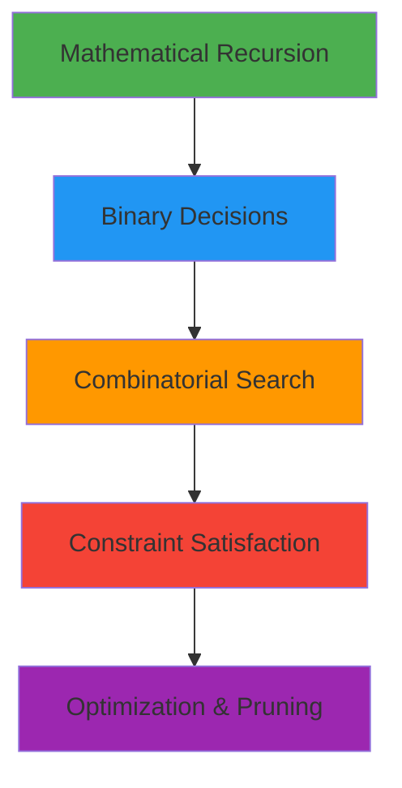

<div align="center">

# 🎯 Decision Matrix

### *Advanced Recursive Decision Making & Backtracking*

[](.)
[](.)
[](.)
[](.)

---

**Master recursive decision-making through mathematical computation and combinatorial algorithms**  
*Part of [c-challenges-solved](../../) repository*

[Overview](#-overview) • [Exercises](#-exercises) • [Compilation](#%EF%B8%8F-compilation) • [Testing](#-testing)

</div>

---

## 📋 Overview

**Decision Matrix** focuses on recursive functions that make **binary or multiple choices** at each step. These exercises combine mathematical recursion with advanced backtracking, teaching you how to explore solution spaces efficiently through systematic decision-making.

### 🎯 What You'll Learn



| Category | Exercises | Complexity |
|:---------|:----------|:----------:|
| **Mathematical** | factorial, power, fibonacci, sum_array | ⭐⭐ |
| **Binary Choice** | subsets, power_sum | ⭐⭐⭐ |
| **Combinatorial** | combinations, permutations | ⭐⭐⭐⭐ |
| **CSP** | n_queens, solve_maze | ⭐⭐⭐⭐⭐ |

---

## 📚 Exercises

### 🔢 Exercise 1: `ft_factorial`

> Calculate factorial using recursion

```c
int ft_factorial(int n);
```

**Mathematical Definition:**
```
n! = n × (n-1)!
0! = 1
```

<details>
<summary>📖 View Examples</summary>

```bash
$> ./ft_factorial 5
factorial 5 is: 120
$>
$> ./ft_factorial 0
factorial 0 is: 1
$>
$> ./ft_factorial 10
factorial 10 is: 3628800
$>
```
</details>

**Requirements:**
- ✅ Take exactly **one argument**
- ✅ Handle **n ≤ 0** (return 1)
- ✅ Use **recursion only**
- ✅ Output format: `factorial N is: RESULT\n`

**Decision Pattern:** Linear recursion - single path forward

---

### 🌀 Exercise 2: `ft_fibonacci`

> Calculate the nth Fibonacci number

```c
int ft_fib(int n);
```

**Mathematical Definition:**
```
F(0) = 0, F(1) = 1
F(n) = F(n-1) + F(n-2)
```

<details>
<summary>📖 View Examples</summary>

```bash
$> ./ft_fibonacci 0
fibo(0) = 0
$>
$> ./ft_fibonacci 5
fibo(5) = 5
$>
$> ./ft_fibonacci 10
fibo(10) = 55
$>
```
</details>

**Requirements:**
- ✅ Take exactly **one argument**
- ✅ Return **n** for n ≤ 1
- ✅ Use **recursion only**
- ✅ Output format: `fibo(N) = RESULT\n`

**Decision Pattern:** Tree recursion - two branches per call

⚠️ **Warning:** O(2ⁿ) complexity - exponentially slow!

---

### ⚡ Exercise 3: `ft_power`

> Calculate base raised to exponent

```c
long ft_power(int base, int exp);
```

**Mathematical Definition:**
```
base⁰ = 1
base^exp = base × base^(exp-1)
```

<details>
<summary>📖 View Examples</summary>

```bash
$> ./ft_power 2 5
2 power 5 is: 32
$>
$> ./ft_power 10 0
10 power 0 is: 1
$>
$> ./ft_power -2 3
-2 power 3 is: -8
$>
```
</details>

**Requirements:**
- ✅ Take exactly **two arguments** (base, exp)
- ✅ Return **1** for exp ≤ 0
- ✅ Use **long return type**
- ✅ Output format: `BASE power EXP is: RESULT\n`

**Decision Pattern:** Linear recursion with parameter reduction

---

### 📊 Exercise 4: `ft_sum_array`

> Sum all array elements recursively

```c
int ft_sum_array(int *arr, int size);
```

<details>
<summary>📖 View Examples</summary>

```bash
$> ./ft_sum_array 1 2 3 4 5
Array is: [1, 2, 3, 4, 5]
Sum of array is: 15
$>
$> ./ft_sum_array 5
Array is: [5]
Sum of array is: 5
$>
$> ./ft_sum_array
Usage: ./a.out <num1> <num2> ...
$>
```
</details>

**Requirements:**
- ✅ **Dynamic memory allocation**
- ✅ Process from **end backwards** (size-1)
- ✅ **Free allocated memory**
- ✅ Handle malloc failure

**Decision Pattern:** Linear recursion through array indices

---

### 🎲 Exercise 5: `ft_print_subsets`

> Generate all possible subsets (power set)

```c
void ft_print_subsets(char *str);
```

**Decision Pattern:** For each character, make **two choices**:
1. **Exclude** it (skip)
2. **Include** it (add to buffer)

<details>
<summary>📖 View Examples</summary>

```bash
$> ./ft_print_subsets "abc"

c
b
bc
a
ac
ab
abc
$>
$> ./ft_print_subsets "12"

2
1
12
$>
```
</details>

**Requirements:**
- ✅ Print **empty subset** (first line)
- ✅ Total subsets = **2ⁿ**
- ✅ Dynamic memory for buffer
- ✅ Free allocated memory

**Decision Pattern:** Binary choice tree - Include/Exclude at each level

---

### 🎯 Exercise 6: `ft_power_sum_count`

> Count ways to express X as sum of unique Nth powers

```c
int ft_power_sum_count(int x, int n);
```

**Problem:** How many ways can we write X = a₁ⁿ + a₂ⁿ + ... where all aᵢ are unique?

**Example:**
```
X=10, N=2: only 1² + 3² = 10  →  count = 1
X=100, N=2: three ways  →  count = 3
  • 10²
  • 6² + 8²
  • 1² + 3² + 4² + 5² + 7²
```

<details>
<summary>📖 View Examples</summary>

```bash
$> ./ft_power_sum_count 10 2
count is: 1
$>
$> ./ft_power_sum_count 100 2
count is: 3
$>
```
</details>

**Requirements:**
- ✅ Two arguments: **X** (target) and **N** (power)
- ✅ Each number used **at most once**
- ✅ Return **count** of valid combinations
- ✅ **Pruning**: stop when power exceeds remaining sum

**Decision Pattern:** Binary choice with pruning - Include/Skip each power

---

### 🔀 Exercise 7: `ft_print_combinations`

> Generate all k-length combinations from a string

```c
void ft_print_combinations(char *str, int k);
```

**Concept:** Select **k characters** from string where order doesn't matter and no repeats.

**Example:**
```
str="abc", k=2:
  ab
  ac
  bc
```

<details>
<summary>📖 View Examples</summary>

```bash
$> ./ft_print_combinations "abcd" 2
ab
ac
ad
bc
bd
cd
$>
$> ./ft_print_combinations "abc" 3
abc
$>
$> ./ft_print_combinations "12345" 3
123
124
125
134
135
145
234
235
245
345
$>
```
</details>

**Requirements:**
- ✅ Select **k characters** from string
- ✅ **No repeats** - each character used once
- ✅ **Order doesn't matter** - only increasing indices
- ✅ Dynamic memory allocation
- ✅ Free allocated memory

**Decision Pattern:** Bounded exploration - choose from remaining characters

---

### 🔄 Exercise 8: `ft_print_permutations`

> Generate all permutations of a string

```c
void ft_print_permutations(char *str);
```

**Concept:** Generate all possible **orderings** of characters where each character appears exactly once.

**Example:**
```
str="abc":
  abc
  acb
  bac
  bca
  cab
  cba
```

<details>
<summary>📖 View Examples</summary>

```bash
$> ./ft_print_permutations "abc"
abc
acb
bac
bca
cab
cba
$>
$> ./ft_print_permutations "12"
12
21
$>
$> ./ft_print_permutations "xyz"
xyz
xzy
yxz
yzx
zxy
zyx
$>
```
</details>

**Requirements:**
- ✅ Generate **all orderings** (n! permutations)
- ✅ Use **used array** to track chosen characters
- ✅ Each character appears **exactly once**
- ✅ Dynamic memory for buffer and used array
- ✅ Free all allocated memory

**Decision Pattern:** Exhaustive search with state tracking - try each unused character

---

### ♛ Exercise 9: `ft_n_queens_puzzle`

> Solve the classic N-Queens problem

```c
int ft_n_queens_puzzle(int n);
```

**Problem:** Place N queens on N×N board so no two queens attack each other.

**Constraints:**
- ❌ No two queens in same row
- ❌ No two queens in same column  
- ❌ No two queens on same diagonal

**Output Format:** Each solution is a string where digit at position i = column position of queen in row i.

<details>
<summary>📖 View Examples</summary>

```bash
$> ./ft_n_queens_puzzle 4
1302
2031
this is total possible place: 2
$>
$> ./ft_n_queens_puzzle 1
0
this is total possible place: 1
$>
$> ./ft_n_queens_puzzle 8
04752613
05726314
# ... (92 solutions total)
this is total possible place: 92
$>
```

**Solution "1302" means:**
```
Row 0: Queen at column 1
Row 1: Queen at column 3
Row 2: Queen at column 0
Row 3: Queen at column 2
```
</details>

**Requirements:**
- ✅ Print **all solutions**
- ✅ Return **total count**
- ✅ Dynamic memory allocation
- ✅ Backtracking algorithm
- ✅ Efficient validation function

**Helper Functions:**
```c
int is_valid(int *board, int row, int col);  // Check placement
void ft_putboard(int *board, int n);         // Print solution
int solve_helper(int *board, int col, int n); // Recursive solver
```

**Fun Facts:**
- 4-Queens: **2** solutions
- 8-Queens: **92** solutions  
- 10-Queens: **724** solutions

**Decision Pattern:** Constraint satisfaction - place queens with validation at each step

---

### 🗺️ Exercise 10: `ft_solve_maze`

> Find a path through a maze using backtracking

```c
int ft_solve_maze(char **map, int rows, int cols);
```

**Problem:** Navigate from top-left corner (0,0) to bottom-right corner (rows-1, cols-1) in a maze.

**Maze Representation:**
- `'0'` = Walkable path
- `'1'` = Wall (obstacle)
- `'x'` = Visited/Solution path

**Movement Rules:**
- Can move in **4 directions**: Right, Down, Left, Up
- Cannot move through walls (`'1'`)
- Cannot revisit already visited cells (`'x'`)
- Must stay within maze boundaries

<details>
<summary>📖 View Examples</summary>

```bash
$> ./ft_solve_maze
>> = You can walk on it$
>> # you cannot walk on it$
>> o is the path we found$
Result:$
ooo#============$
##o#=####=######$
=oo==#====#=====$
=o#########=####$
=ooooo=#=====#==$
=#=##o###=##=#==$
=#=#=oooooooo#==$
=#=#=###=###o#==$
=#=#======ooo#==$
=###=#####o#=#==$
=====#===#o#=#==$
=#=###=###o#=#==$
ooooooooooo##===$
o###########=###$
oooo#ooooo#ooooo$
=##ooo###ooo##=o$
```

**Path Visualization:**
- `=` represents walkable cells (`'0'`)
- `#` represents walls (`'1'`)
- `o` represents the solution path (`'x'`)

</details>

**Requirements:**
- ✅ **2D dynamic array** for maze map
- ✅ **Four-directional exploration** (Right → Down → Left → Up)
- ✅ **Backtracking** when path is blocked
- ✅ Mark visited cells with `'x'`
- ✅ Restore cells on backtrack
- ✅ Return **1** if path found, **0** otherwise
- ✅ Free all allocated memory

**Helper Functions:**
```c
int is_valid(char **map, int rows, int cols, int row, int col);  // Check if move is valid
int ft_solve_helper(char **map, int rows, int cols, int row, int col);  // Recursive solver
void print_realistic_maze(char **map, int rows);  // Display solution
```

**Algorithm Flow:**
1. Start at position (0, 0)
2. Mark current position as visited (`'x'`)
3. If reached destination (rows-1, cols-1), return success
4. Try moving in all 4 directions:
   - Right (col + 1)
   - Down (row + 1)
   - Left (col - 1)
   - Up (row - 1)
5. If any direction leads to solution, return success
6. If all directions fail, backtrack (restore original cell value)

**Decision Pattern:** Directional backtracking - explore all paths with state restoration

---

## 🛠️ Compilation

### Individual Exercise
```bash
gcc -Wall -Wextra -Werror <exercise>.c -o <exercise>
```

### All Exercises
```bash
# Quick compile script
for f in ft_*.c; do
    gcc -Wall -Wextra -Werror "$f" -o "${f%.c}"
done
```

### With Debug Symbols
```bash
gcc -Wall -Wextra -Werror -g <exercise>.c -o <exercise>
```

---

## 🧪 Testing

### Mathematical Functions
```bash
# Factorial
./ft_factorial 0
./ft_factorial 5
./ft_factorial 10

# Fibonacci
./ft_fibonacci 0
./ft_fibonacci 1
./ft_fibonacci 10

# Power
./ft_power 2 5
./ft_power 10 0
./ft_power -2 3

# Sum Array
./ft_sum_array 1 2 3 4 5
./ft_sum_array
```

### Binary Decision Problems
```bash
# Subsets
./ft_print_subsets "abc"
./ft_print_subsets "12345"

# Power Sum
./ft_power_sum_count 10 2
./ft_power_sum_count 100 2
./ft_power_sum_count 100 3
```

### Combinatorial Problems
```bash
# Combinations
./ft_print_combinations "abc" 2
./ft_print_combinations "12345" 3

# Permutations
./ft_print_permutations "abc"
./ft_print_permutations "1234"

# N-Queens
./ft_n_queens_puzzle 4
./ft_n_queens_puzzle 8

# Maze Solver
./ft_solve_maze
```

### Memory Leak Detection
```bash
valgrind --leak-check=full ./ft_sum_array 1 2 3
valgrind --leak-check=full ./ft_print_subsets "abc"
valgrind --leak-check=full ./ft_print_combinations "abcd" 2
valgrind --leak-check=full ./ft_print_permutations "abc"
valgrind --leak-check=full ./ft_n_queens_puzzle 4
valgrind --leak-check=full ./ft_solve_maze
```

---

## 📊 Complexity Analysis

| Exercise | Time | Space | Output Size | Decision Type |
|:---------|:----:|:-----:|:-----------:|:--------------|
| `ft_factorial` | O(n) | O(n) | 1 value | Linear |
| `ft_fibonacci` | O(2ⁿ) | O(n) | 1 value | Tree (2-way) |
| `ft_power` | O(exp) | O(exp) | 1 value | Linear |
| `ft_sum_array` | O(n) | O(n) | 1 value | Linear |
| `ft_print_subsets` | O(2ⁿ) | O(n) | 2ⁿ subsets | Binary choice |
| `ft_power_sum_count` | O(√x·2^√x) | O(√x) | 1 count | Binary + prune |
| `ft_print_combinations` | O(C(n,k)) | O(k) | C(n,k) combos | k-way choice |
| `ft_print_permutations` | O(n!) | O(n) | n! perms | n-way choice |
| `ft_n_queens_puzzle` | O(n!) | O(n) | varies | Constrained |
| `ft_solve_maze` | O(4^(rows×cols)) | O(rows×cols) | 1 path | Directional backtrack |

**Legend:**
- C(n,k) = n!/(k!(n-k)!) - Combinations
- n! = n × (n-1) × ... × 1 - Permutations

---

## 🎓 Decision Patterns Explained

### 1️⃣ Linear Recursion
**Pattern:** Single recursive call, reduce problem size by 1
```c
// Example: factorial
if (n <= 0) return 1;
return n * factorial(n - 1);
```
**Used in:** factorial, power, sum_array

---

### 2️⃣ Tree Recursion
**Pattern:** Multiple recursive calls (usually 2)
```c
// Example: fibonacci
if (n <= 1) return n;
return fib(n-1) + fib(n-2);
```
**Used in:** fibonacci

---

### 3️⃣ Binary Choice (Include/Exclude)
**Pattern:** Two decisions at each step - take it or leave it
```c
// Example: subsets
solve(str, i) {
    // Choice 1: Exclude current character
    solve(str, i+1);
    
    // Choice 2: Include current character
    buffer[depth] = str[i];
    solve(str, i+1);
}
```
**Used in:** print_subsets, power_sum_count

---

### 4️⃣ Bounded Exploration (Combinations)
**Pattern:** Choose from remaining options, respecting order
```c
// Example: combinations
for (i = start; str[i]; i++) {
    buffer[depth] = str[i];
    solve(str, buffer, i+1, depth+1);  // Next must be > i
}
```
**Used in:** print_combinations

---

### 5️⃣ Exhaustive Search (Permutations)
**Pattern:** Try all unused options at each position
```c
// Example: permutations
for (i = 0; str[i]; i++) {
    if (!used[i]) {
        used[i] = 1;           // Mark as used
        buffer[depth] = str[i];
        solve(str, buffer, used, depth+1);
        used[i] = 0;           // Backtrack
    }
}
```
**Used in:** print_permutations

---

### 6️⃣ Constraint Satisfaction (N-Queens)
**Pattern:** Place with validation, backtrack on failure
```c
// Example: n-queens
for (row = 0; row < n; row++) {
    if (is_valid(board, row, col)) {
        board[col] = row;        // Place queen
        solve(board, col+1);     // Try next column
        board[col] = -1;         // Backtrack
    }
}
```
**Used in:** n_queens_puzzle

---

### 7️⃣ Directional Backtracking (Maze Solving)
**Pattern:** Explore all directions, restore state on failure
```c
// Example: maze solver
if (is_valid(map, row, col)) {
    char original = map[row][col];
    map[row][col] = 'x';  // Mark as visited
    
    // Try all 4 directions
    if (solve(map, row, col+1)) return 1;  // Right
    if (solve(map, row+1, col)) return 1;  // Down
    if (solve(map, row, col-1)) return 1;  // Left
    if (solve(map, row-1, col)) return 1;  // Up
    
    map[row][col] = original;  // Backtrack
    return 0;
}
```
**Used in:** solve_maze

---

## 📈 Progression Path

```
Foundation          Branching         Combinations        Optimization        Path Finding
    ↓                  ↓                    ↓                  ↓                   ↓
factorial  →  fibonacci  →  subsets  →  combinations  →  n_queens  →  solve_maze
power         (2-way)        (binary)     (k-way)         (constrained)   (directional)
sum_array                                                  
    ↓                  ↓                    ↓                  ↓                   ↓
 Linear         Tree Recursion      Backtracking      CSP + Validation    Spatial Navigation
```

**Recommended Learning Order:**

**Phase 1 - Foundations** (⭐⭐)
1. ✅ `ft_factorial` - Basic recursion
2. ✅ `ft_power` - Recursion with parameters
3. ✅ `ft_sum_array` - Recursion + arrays

**Phase 2 - Tree Recursion** (⭐⭐⭐)
4. ✅ `ft_fibonacci` - Understand exponential growth

**Phase 3 - Binary Decisions** (⭐⭐⭐)
5. ✅ `ft_print_subsets` - Include/exclude pattern
6. ✅ `ft_power_sum_count` - Binary choice with pruning

**Phase 4 - Combinatorics** (⭐⭐⭐⭐)
7. ✅ `ft_print_combinations` - Bounded exploration
8. ✅ `ft_print_permutations` - Exhaustive search with state

**Phase 5 - Advanced CSP** (⭐⭐⭐⭐⭐)
9. ✅ `ft_n_queens_puzzle` - Constraint satisfaction
10. ✅ `ft_solve_maze` - Path finding with backtracking

---

## ⚠️ Common Pitfalls

### 🔴 Exponential Blowup
```c
// Fibonacci without memoization
fib(40)  // Takes ~1 second
fib(45)  // Takes ~10 seconds
fib(50)  // Takes minutes!
```

### 🔴 Memory Leaks
```c
// Don't forget to free!
char *buffer = malloc(size);
int *used = malloc(n * sizeof(int));
// ... use them ...
free(buffer);
free(used);
```

### 🔴 Stack Overflow
```c
// Too deep recursion
ft_factorial(1000000);  // Crash!
```

### 🔴 Off-by-One Errors
```c
// Combinations: wrong start index
solve_helper(str, buffer, i, depth+1, k);     // ❌ Wrong
solve_helper(str, buffer, i+1, depth+1, k);   // ✅ Correct
```

### 🔴 Not Backtracking
```c
// Permutations: forgot to reset
used[i] = 1;
solve(...);
// ❌ Missing: used[i] = 0;
```

### 🔴 Invalid N-Queens Validation
```c
// Must check BOTH diagonals
if (abs(board[i] - row) == abs(i - col))  // Diagonal check
    return 0;
```

### 🔴 Maze Boundary Issues
```c
// Always validate bounds
if (row < 0 || col < 0 || row >= rows || col >= cols)
    return 0;
```

### 🔴 Not Restoring State in Maze
```c
// Must save and restore original value
char original = map[row][col];
map[row][col] = 'x';
// ... try paths ...
map[row][col] = original;  // ✅ Restore!
```

---

## 💡 Pro Tips

### ✨ Optimization Strategies

**Pruning Early**
```c
// Power sum: stop when power too large
if (power > remaining_sum)
    return 0;  // Prune this branch
```

**State Tracking**
```c
// Use arrays to track state
int used[n];  // For permutations
int board[n]; // For n-queens
char **map;   // For maze
```

**Efficient Base Cases**
```c
// Handle edge cases first
if (n <= 0) return 1;
if (n == 1) return 1;
// ... then recurse
```

**Directional Optimization (Maze)**
```c
// Try most promising directions first
// For bottom-right goal: Right → Down → Left → Up
if (solve(map, row, col+1)) return 1;  // Right (closer to goal)
if (solve(map, row+1, col)) return 1;  // Down (closer to goal)
if (solve(map, row, col-1)) return 1;  // Left
if (solve(map, row-1, col)) return 1;  // Up
```

### 🛠 Debugging Techniques

**Trace Recursion**
```bash
# Add printf to see calls
printf("→ depth=%d, i=%d, buffer='%s'\n", depth, i, buffer);
```

**Visualize Tree**
```c
// Indent based on depth
void print_indent(int depth) {
    for (int i = 0; i < depth; i++)
        printf("  ");
}
```

**Count Calls**
```c
static int call_count = 0;
call_count++;
printf("Call #%d\n", call_count);
```

**Maze Path Visualization**
```c
// Print maze at each step
void print_maze_state(char **map, int rows, int row, int col) {
    printf("\n--- At position (%d, %d) ---\n", row, col);
    print_realistic_maze(map, rows);
}
```

### 📝 Best Practices

**Memory Management**
- ✅ Always check `malloc` return value
- ✅ Free in same function that allocates
- ✅ Set pointers to NULL after freeing

**Base Cases**
- ✅ Handle all edge cases
- ✅ Put base case first
- ✅ Make base case obvious

**Code Structure**
- ✅ Separate helper functions
- ✅ Use meaningful variable names
- ✅ Comment complex logic

**Maze-Specific**
- ✅ Always validate boundaries first
- ✅ Save original cell value before modification
- ✅ Restore state when backtracking
- ✅ Check for destination before recursing

---

## 📝 Understanding Output Patterns

### Subsets vs Combinations vs Permutations

**Input:** "abc"

| Pattern | Count | Example Output |
|:--------|:-----:|:---------------|
| **Subsets** | 2³ = 8 | "", "a", "b", "c", "ab", "ac", "bc", "abc" |
| **Combinations (k=2)** | C(3,2) = 3 | "ab", "ac", "bc" |
| **Permutations** | 3! = 6 | "abc", "acb", "bac", "bca", "cab", "cba" |

**Key Differences:**
- **Subsets**: All sizes (0 to n), order doesn't matter
- **Combinations**: Fixed size k, order doesn't matter, no repeats
- **Permutations**: All elements, order MATTERS, no repeats

### Maze Solutions

**Input:** 16×16 maze with walls and paths

| Output | Meaning |
|:-------|:--------|
| `=` | Walkable cell (not on solution path) |
| `#` | Wall/obstacle |
| `o` | Solution path from start to end |

**Path Properties:**
- **Uniqueness**: May have multiple valid paths
- **Optimality**: Not necessarily the shortest path
- **Validity**: Never crosses walls or boundaries

---

## 🔗 Related Topics

### In This Repository
- [Linear Drills](../Linear_Drills/) - Basic recursion practice (void functions)
- [42 Piscine Practice](../../42-piscine-practice/) - Fundamental C exercises
- [Level 0](../../42-piscine-practice/level_0/) - Basic C programs
- [Level 1](../../42-piscine-practice/level_1/) - String manipulation
- [Level 2](../../42-piscine-practice/level_2/) - Advanced string operations

### External Resources
- [Backtracking - Wikipedia](https://en.wikipedia.org/wiki/Backtracking)
- [Combinatorics - Khan Academy](https://www.khanacademy.org/math/statistics-probability/counting-permutations-and-combinations)
- [N-Queens Problem](https://en.wikipedia.org/wiki/Eight_queens_puzzle)
- [Decision Tree - GeeksforGeeks](https://www.geeksforgeeks.org/decision-tree/)

---

<div align="center">

### 🎓 Learning Outcomes

After mastering these exercises, you will understand:

**Mathematical** | **Algorithmic** | **Optimization**
:---: | :---: | :---:
Recursive computation | Backtracking patterns | Pruning strategies
Tree recursion | State management | Early termination
Base case design | Constraint checking | Space-time tradeoffs

**Binary Decisions** | **Combinatorial** | **Problem Solving**
:---: | :---: | :---:
Include/Exclude | Combinations | Decision trees
Choice exploration | Permutations | Solution spaces
Path enumeration | Ordered vs Unordered | Search strategies

---

### 📫 Need Help?

If you find any issues or have suggestions:
- 🐛 [Report a bug](../../issues)
- 💡 [Request a feature](../../issues)
- ⭐ [Star this repo](../../)

---

**Made with ❤️ for mastering recursive decision-making**

*Build on [Linear Drills](../Linear_Drills/) foundation*

[](../../)
[](../Linear_Drills/)

</div>
