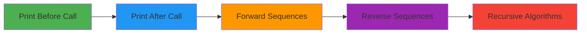

<div align="center">

# 🎯 Linear Drills

### *Recursive Functions that Print Output*

[](.)
[](.)
[](.)
[](.)

---

**A collection of beginner-friendly recursive functions that print formatted output**  
*Part of [c-challenges-solved](../../) repository*

[Overview](#-overview) • [Exercises](#-exercises) • [Compilation](#%EF%B8%8F-compilation) • [Testing](#-testing)

</div>

---

## 📋 Overview

This module introduces **void-type recursive functions** that focus on printing formatted sequences and manipulating data. These exercises are perfect for understanding the basics of recursion, call stack behavior, and the difference between printing before vs. after recursive calls.

### 🎯 What You'll Learn



| Concept | Exercises | Pattern |
|:--------|:----------|:--------|
| **Print After** | put_n_number, put_alpha | Forward: 0 > 1 > 2 > 3 |
| **Print Before** | put_revn_number, put_rev_alpha | Reverse: 3 > 2 > 1 > 0 |
| **Recursive Algorithms** | sort_string_recursive | Bubble Sort with recursion |

---

## 📚 Exercises

### 🔢 Exercise 1: `put_n_number`

> Print numbers from 0 to N in ascending order

```c
void recrtion(int n);
```

**Pattern:** Print **after** recursive call
```
recrtion(3):
  recrtion(2)
    recrtion(1)
      recrtion(0)
        print "0"
      print " > 1"
    print " > 2"
  print " > 3"
```

<details>
<summary>📖 View Examples</summary>

```bash
$> ./put_n_number 5
0 > 1 > 2 > 3 > 4 > 5
$>
$> ./put_n_number 0
0
$>
$> ./put_n_number 10
0 > 1 > 2 > 3 > 4 > 5 > 6 > 7 > 8 > 9 > 10
$>
$> ./put_n_number
# Prints only newline
$>
```
</details>

**Requirements:**
- ✅ Take exactly **one argument** (or none)
- ✅ Base case: **n == 0**
- ✅ Print **after** recursive call (forward order)
- ✅ Format: `0 > 1 > 2 > ... > N\n`
- ✅ Always print **newline** at the end

**Key Learning:** When you print **after** the recursive call, output appears in **forward order** (0 → N).

---

### 🔄 Exercise 2: `put_revn_number`

> Print numbers from N to 0 in descending order

```c
void put_revn_number(int n);
```

**Pattern:** Print **before** recursive call
```
put_revn_number(3):
  print "3 > "
  put_revn_number(2)
    print "2 > "
    put_revn_number(1)
      print "1 > "
      put_revn_number(0)
        print "0\n"
```

<details>
<summary>📖 View Examples</summary>

```bash
$> ./put_revn_number 5
5 > 4 > 3 > 2 > 1 > 0
$>
$> ./put_revn_number 0
0
$>
$> ./put_revn_number 10
10 > 9 > 8 > 7 > 6 > 5 > 4 > 3 > 2 > 1 > 0
$>
$> ./put_revn_number
# No output (argc != 2)
$>
```
</details>

**Requirements:**
- ✅ Take exactly **one argument** (or none)
- ✅ Base case: **n == 0** (print with `\n`)
- ✅ Print **before** recursive call (reverse order)
- ✅ Format: `N > N-1 > ... > 1 > 0\n`
- ✅ Base case handles **newline**

**Key Learning:** When you print **before** the recursive call, output appears in **reverse order** (N → 0).

---

### 🔤 Exercise 3: `put_alpha`

> Print alphabet from a/A to z/Z in ascending order

```c
void put_alpha(char c);
```

**Pattern:** Print **after** recursive call (like put_n_number)
```
put_alpha('a'):
  print "a > "
  put_alpha('b')
    ...
      put_alpha('z')
        print " > z"  (base case)
```

<details>
<summary>📖 View Examples</summary>

```bash
$> ./put_alpha a
a > b > c > d > e > f > g > h > i > j > k > l > m > n > o > p > q > r > s > t > u > v > w > x > y > z
$>
$> ./put_alpha A
A > B > C > D > E > F > G > H > I > J > K > L > M > N > O > P > Q > R > S > T > U > V > W > X > Y > Z
$>
$> ./put_alpha b
Please enter a for lowercase alpha or A for uppercase alpha
$>
$> ./put_alpha
Please enter a for lowercase alpha or A for uppercase alpha
$>
```
</details>

**Requirements:**
- ✅ Take exactly **'a'** or **'A'** as argument
- ✅ Must be **single character** only
- ✅ Base case: **c == 'z'** or **c == 'Z'**
- ✅ Print **after** recursive call (forward order)
- ✅ Format: `a > b > ... > z\n`
- ✅ Error message for invalid input
- ✅ Return **1** on error

**Key Learning:** Same pattern as numbers, but with characters. Validate input strictly!

---

### 🔃 Exercise 4: `put_rev_alpha`

> Print alphabet from z/Z to a/A in descending order

```c
void put_rev_alpha(char c);
```

**Pattern:** Print **after** recursive call but process backwards
```
put_rev_alpha('a'):
  put_rev_alpha('b')
    ...
      put_rev_alpha('z')
        print "z"
    print " > y"
  print " > b"
print " > a"
```

<details>
<summary>📖 View Examples</summary>

```bash
$> ./put_rev_alpha a
z > y > x > w > v > u > t > s > r > q > p > o > n > m > l > k > j > i > h > g > f > e > d > c > b > a
$>
$> ./put_rev_alpha A
Z > Y > X > W > V > U > T > S > R > Q > P > O > N > M > L > K > J > I > H > G > F > E > D > C > B > A
$>
$> ./put_rev_alpha z
Please enter a for lowercase alpha or A for uppercase alpha
$>
$> ./put_rev_alpha AA
Please enter a for lowercase alpha or A for uppercase alpha
$>
```
</details>

**Requirements:**
- ✅ Take exactly **'a'** or **'A'** as argument
- ✅ Must be **single character** only
- ✅ Base case: **c == 'z'** or **c == 'Z'** (print without separator)
- ✅ Print **after** recursive call (prints in reverse)
- ✅ Format: `z > y > ... > a\n`
- ✅ Error message for invalid input
- ✅ Return **1** on error

**Key Learning:** Even with print **after** call, we can get reverse order by recursing forward first!

---

### 🔀 Exercise 5: `sort_string_recursive`

> Sort a string using recursive bubble sort

```c
void sort_string(char *str);
```

**Pattern:** Recursive bubble sort implementation
```
sort_string("25143"):
  Pass 1: Bubble largest to end → "21453"
  sort_string (next pass):
    Pass 2: Bubble second largest → "21435"
    sort_string (next pass):
      ...until sorted → "12345"
```

<details>
<summary>📖 View Examples</summary>

```bash
$> ./sort_string_recursive
Before Recursive: 25143
After Recursive: 12345
$>
```

**How it works:**
```
Input:  "25143"
Pass 1: "21453" (5 bubbled to position 4)
Pass 2: "21435" (4 bubbled to position 3)
Pass 3: "12435" (sorted up to position 2)
Pass 4: "12345" (fully sorted)
```
</details>

**Requirements:**
- ✅ Implement **bubble sort recursively**
- ✅ Use **helper function** `solve_helper(str, start, len)`
- ✅ Implement **comparison function** `ft_strcmp(c1, c2)`
- ✅ Implement **swap function** `ft_swap(c1, c2)`
- ✅ Sort in **ascending order**
- ✅ Modify string **in-place**
- ✅ Handle any ASCII characters

**Helper Functions:**
```c
int ft_strcmp(char c1, char c2);              // Compare two characters
void ft_swap(char *c1, char *c2);             // Swap two characters
void solve_helper(char *str, int start, int len); // Recursive sorting
```

**Algorithm Explanation:**
```c
solve_helper(str, start, len):
  Base case: if (start == len) return
  
  For each position from 0 to (len - 1 - start):
    If current > next:
      Swap them
  
  Recursively call with (start + 1)
```

**Key Learning:** Recursion can implement classic algorithms like bubble sort. Each recursive call performs one complete pass through the array.

**Complexity:**
- Time: O(n²) - Same as iterative bubble sort
- Space: O(n) - Recursion stack depth

---

## 🛠️ Compilation

### Individual Exercise
```bash
gcc -Wall -Wextra -Werror <exercise>.c -o <exercise>
```

### All Exercises
```bash
# Quick compile script
for f in *.c; do
    gcc -Wall -Wextra -Werror "$f" -o "${f%.c}"
done
```

### With Debug Symbols
```bash
gcc -Wall -Wextra -Werror -g <exercise>.c -o <exercise>
```

---

## 🧪 Testing

### Basic Tests
```bash
# Numbers - Forward
./put_n_number 5
./put_n_number 0
./put_n_number 100

# Numbers - Reverse  
./put_revn_number 5
./put_revn_number 0
./put_revn_number 100

# Alphabet - Forward
./put_alpha a
./put_alpha A

# Alphabet - Reverse
./put_rev_alpha a
./put_rev_alpha A

# String Sorting
./sort_string_recursive
```

### Edge Cases
```bash
# No arguments
./put_n_number
./put_revn_number
./put_alpha
./put_rev_alpha

# Invalid arguments for alpha
./put_alpha b
./put_alpha abc
./put_alpha 1
./put_rev_alpha Z
```

### Validation Tests
```bash
# Test strict input validation
./put_alpha "a"     # Valid
./put_alpha "aa"    # Invalid - multiple chars
./put_alpha ""      # Invalid - empty
./put_alpha "b"     # Invalid - not 'a' or 'A'
```

### Sorting Tests
```bash
# Modify the main() in sort_string_recursive.c to test different strings
# Test cases:
# - Already sorted: "12345"
# - Reverse order: "54321"
# - Random order: "31524"
# - With duplicates: "11223"
# - Mixed case: "bAcDe"
```

---

## 📊 Understanding Print Order

### 🔄 Print After Call (Forward Order)

```c
void forward(int n) {
    if (n == 0) {
        printf("0");
        return;
    }
    forward(n - 1);     // Recurse first
    printf(" > %d", n);  // Print after
}
```

**Execution Flow for n=3:**
```
Call Stack:           Output Order:
forward(3)           
  forward(2)         
    forward(1)       
      forward(0) →   "0"
    return       →   " > 1"
  return         →   " > 2"
return           →   " > 3"
```
**Result:** `0 > 1 > 2 > 3`

---

### 🔃 Print Before Call (Reverse Order)

```c
void reverse(int n) {
    if (n == 0) {
        printf("0\n");
        return;
    }
    printf("%d > ", n);  // Print first
    reverse(n - 1);      // Then recurse
}
```

**Execution Flow for n=3:**
```
Call Stack:           Output Order:
reverse(3)       →   "3 > "
  reverse(2)     →   "2 > "
    reverse(1)   →   "1 > "
      reverse(0) →   "0\n"
```
**Result:** `3 > 2 > 1 > 0`

---

### 🔀 Recursive Algorithm Pattern (Bubble Sort)

```c
void solve_helper(char *str, int start, int len) {
    if (start == len)    // Base case
        return;
    
    // One pass: bubble largest element
    for (int i = 0; i < (len - 1 - start); i++) {
        if (str[i] > str[i + 1])
            swap(&str[i], &str[i + 1]);
    }
    
    // Recursive call for next pass
    solve_helper(str, start + 1, len);
}
```

**Execution Flow for "321":**
```
Pass 1 (start=0): "231" → 3 moved to end
Pass 2 (start=1): "213" → 2 moved to position
Pass 3 (start=2): "123" → Done
```

---

## 📈 Complexity Analysis

| Exercise | Time | Space | Depth | Output |
|:---------|:----:|:-----:|:-----:|:------:|
| `put_n_number` | O(n) | O(n) | n | Forward |
| `put_revn_number` | O(n) | O(n) | n | Reverse |
| `put_alpha` | O(26) | O(26) | 26 | Forward |
| `put_rev_alpha` | O(26) | O(26) | 26 | Reverse |
| `sort_string_recursive` | O(n²) | O(n) | n | Sorted |

**Note:** First four exercises have **linear complexity**. The sorting exercise has **quadratic time** but **linear space** complexity.

---

## ⚠️ Common Pitfalls

### 🔴 Forgetting Base Case
```c
// Infinite recursion!
void bad_print(int n) {
    printf("%d > ", n);
    bad_print(n - 1);  // Never stops!
}
```

### 🔴 Wrong Print Position
```c
// Wanted forward but got reverse
void wrong_forward(int n) {
    if (n == 0) return;
    printf("%d > ", n);  // ❌ Prints before call
    wrong_forward(n - 1);
}
```

### 🔴 Incorrect Format
```c
// Missing separator or newline
void bad_format(int n) {
    if (n == 0) {
        printf("0");  // ❌ Missing \n
        return;
    }
    bad_format(n - 1);
    printf("%d", n);  // ❌ Missing " > "
}
```

### 🔴 Not Validating Input (Alpha)
```c
// Should reject non-'a'/'A' inputs
if (argv[1][0] == 'a' || argv[1][0] == 'A') {
    // ❌ What if argv[1][1] != '\0'?
    // ❌ Need: argv[1][1] == '\0'
}
```

### 🔴 Sorting Pitfalls
```c
// Wrong loop boundary in bubble sort
for (i = 0; i < len; i++)  // ❌ Will access str[len]
    if (str[i] > str[i + 1])

// Correct version:
for (i = 0; i < (len - 1 - start); i++)  // ✅ Proper boundary
    if (str[i] > str[i + 1])
```

---

## 💡 Pro Tips

### ✨ Understanding the Pattern

| When to Print | Order | Use Case |
|:-------------|:------|:---------|
| **After Call** | Forward | Count up, a→z |
| **Before Call** | Reverse | Count down, z→a |
| **After + Forward Recursion** | Reverse | z→a with print after |
| **Algorithm Pattern** | Modified | Bubble sort, selection sort |

### 🎯 Debugging Tips
```bash
# Add trace to understand flow
void put_n_number(int n) {
    printf("[Entering: n=%d]\n", n);  // Trace
    if (n == 0) {
        printf("0");
        printf("[Base case reached]\n");  // Trace
        return;
    }
    put_n_number(n - 1);
    printf(" > %d", n);
    printf("[Returning from n=%d]\n", n);  // Trace
}
```

### 🔍 Sorting Debug Tips
```c
// Add debug output in solve_helper
void solve_helper(char *str, int start, int len) {
    printf("Pass %d: %s\n", start, str);  // See each pass
    if (start == len)
        return;
    // ... rest of code
}
```

### 📝 Good Practices
- ✅ Always validate input strictly
- ✅ Handle edge cases (0, negative, invalid chars)
- ✅ Use clear base case conditions
- ✅ Be consistent with formatting
- ✅ Always end with newline
- ✅ Use helper functions for complex algorithms
- ✅ Keep swap and comparison logic separate

---

## 📈 Progression Path

```
Start Here          Basic Understanding      Master the Pattern       Algorithms
    ↓                      ↓                        ↓                      ↓
put_n_number  →  put_revn_number  →  put_alpha  →  put_rev_alpha  →  sort_string
    ↓                      ↓                        ↓                      ↓
Print After         Print Before          Character Recursion      Recursive Sorting
(Forward)           (Reverse)             (Same Patterns)          (Algorithm Design)
```

**Recommended Order:**
1. ✅ `put_n_number` - Learn print **after** (forward)
2. ✅ `put_revn_number` - Learn print **before** (reverse)
3. ✅ `put_alpha` - Apply to characters (forward)
4. ✅ `put_rev_alpha` - Apply to characters (reverse)
5. ✅ `sort_string_recursive` - Apply recursion to algorithms

---

## 🔗 Related Topics

### In This Repository
- [Decision Matrix](../Decision_Matrix/) - Functions that return values
- [42 Piscine Practice](../../42-piscine-practice/) - Fundamental C exercises
- [Level 0](../../42-piscine-practice/level_0/) - Basic output functions
- [Level 1](../../42-piscine-practice/level_1/) - String manipulation

### Key Differences

| Linear Drills | Decision Matrix |
|:----------------|:------------------|
| Focus on **output** | Focus on **computation** |
| Print to screen | Return values |
| No return value needed | Combine results recursively |
| Simpler to understand | More complex logic |
| Includes algorithms | Mathematical problems |

---

## 🎓 Visualization Guide

### Call Stack Visualization

```
put_n_number(3) call stack:

┌─────────────────┐
│  main()         │
├─────────────────┤
│  put_n_number(3)│ ← Waiting
├─────────────────┤
│  put_n_number(2)│ ← Waiting
├─────────────────┤
│  put_n_number(1)│ ← Waiting
├─────────────────┤
│  put_n_number(0)│ ← Executing (base case)
└─────────────────┘
        ↓
    Prints "0"
        ↓
┌─────────────────┐
│  main()         │
├─────────────────┤
│  put_n_number(3)│ ← Waiting
├─────────────────┤
│  put_n_number(2)│ ← Waiting
├─────────────────┤
│  put_n_number(1)│ ← Resuming
└─────────────────┘
        ↓
    Prints " > 1"
        ↓
    And so on...
```

### Bubble Sort Visualization

```
sort_string_recursive("54321"):

Initial: [5][4][3][2][1]

Pass 1 (start=0):
  Compare: 5>4? swap → [4][5][3][2][1]
  Compare: 5>3? swap → [4][3][5][2][1]
  Compare: 5>2? swap → [4][3][2][5][1]
  Compare: 5>1? swap → [4][3][2][1][5] ← 5 in place

Pass 2 (start=1):
  Compare: 4>3? swap → [3][4][2][1][5]
  Compare: 4>2? swap → [3][2][4][1][5]
  Compare: 4>1? swap → [3][2][1][4][5] ← 4 in place

Pass 3 (start=2):
  Compare: 3>2? swap → [2][3][1][4][5]
  Compare: 3>1? swap → [2][1][3][4][5] ← 3 in place

Pass 4 (start=3):
  Compare: 2>1? swap → [1][2][3][4][5] ← Fully sorted

Result: [1][2][3][4][5]
```

---

<div align="center">

### 🎓 Learning Outcomes

After mastering these exercises, you will understand:

**Core Concepts** | **Output Control** | **Best Practices** | **Algorithms**
:---: | :---: | :---: | :---:
Recursion basics | Print before vs after | Input validation | Recursive sorting
Call stack flow | Forward sequences | Error handling | Helper functions
Base cases | Reverse sequences | Clean formatting | In-place modification

---

### 📫 Need Help?

If you find any issues or have suggestions:
- 🐛 [Report a bug](../../issues)
- 💡 [Request a feature](../../issues)
- ⭐ [Star this repo](../../)

---

**Made with ❤️ for learning void recursion**

*Perfect starting point before tackling [Decision Matrix](../Decision_Matrix/)*

[](../../)
[](../Decision_Matrix/)

</div>
