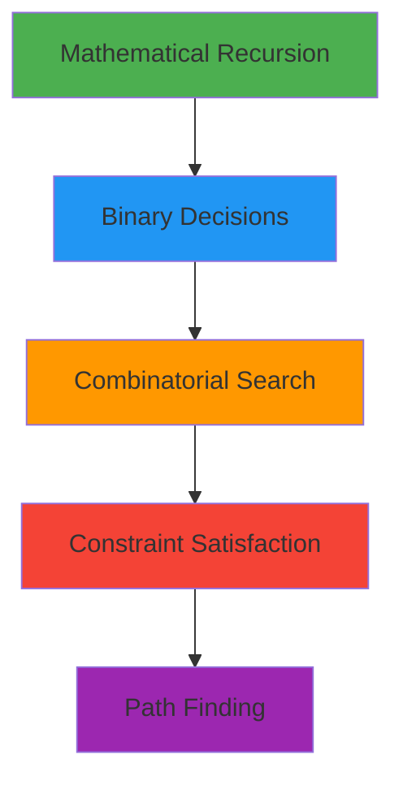

<div align="center">

# 🔄 Challenge Recursion

### *Master the Art of Recursive Problem Solving*

[](.)
[](.)
[](.)
[](.)

---


**A comprehensive collection of recursive programming challenges in C**  
*From basic linear recursion to advanced backtracking algorithms*

[Quick Start](#-quick-start) • [Linear Drills](#-linear-drills) • [Decision Matrix](#-decision-matrix) • [Learning Path](#-learning-path)

</div>

---

## 📁 Repository Structure

```
chalenge_recursion/
├── 📂 Linear_Drills/          # Beginner: Basic recursion patterns
│   ├── put_alpha.c            # Print alphabet forward
│   ├── put_rev_alpha.c        # Print alphabet backward
│   ├── put_n_number.c         # Print numbers 0 to n
│   ├── put_revn_number.c      # Print numbers n to 0
│   ├── sort_string_recursive.c # Recursive bubble sort
│   └── README.md
│
├── 📂 Decision_Matrix/        # Intermediate-Advanced: Decision & Backtracking
│   ├── ft_factorial.c         # Calculate factorial
│   ├── ft_fibonacci.c         # Fibonacci sequence
│   ├── ft_power.c             # Power calculation
│   ├── ft_sum_array.c         # Sum array elements
│   ├── ft_print_subsets.c     # Generate all subsets
│   ├── ft_power_sum_count.c   # Count power sums
│   ├── ft_combinations.c      # Generate combinations
│   ├── ft_print_permutations.c # Generate permutations
│   ├── ft_identity.c          # Self-describing sequences
│   ├── ft_n_queens_puzzle.c   # N-Queens solver
│   ├── ft_solve_maze.c        # Maze pathfinding
│   └── README.md
│
└── README.md                  # This file
```

---

## 🚀 Quick Start

### Clone & Navigate
```bash
git clone <repository-url>
cd chalenge_recursion
```

### Compile Any Exercise
```bash
gcc -Wall -Wextra -Werror <file>.c -o <output>
```

### Compile All at Once
```bash
# Linux/macOS
for f in */*.c; do gcc -Wall -Wextra -Werror "$f" -o "${f%.c}" 2>/dev/null; done
```

---

<div align="center">

# 📘 Linear Drills

### *Foundation: Basic Recursive Patterns*

[](./Linear_Drills/)
[](.)

</div>

---

**Linear Drills** introduces fundamental recursion concepts through simple, predictable patterns. These exercises focus on **void functions** that build intuition for how recursion flows.

### 🎯 What You'll Learn

| Concept | Description |
|:--------|:------------|
| **Head Recursion** | Process after recursive call (reverse order) |
| **Tail Recursion** | Process before recursive call (forward order) |
| **Base Cases** | When to stop recursion |
| **State Passing** | Carrying information through calls |

---

## 📚 Linear Drills Exercises

### 🔤 Exercise 1: `put_alpha`

> Print alphabet from 'a' to 'z' (or 'A' to 'Z') using tail recursion

```c
void put_alpha(char c);
```

**Pattern:** Tail Recursion - Print THEN recurse

```
put_alpha('a') → print 'a' → put_alpha('b') → print 'b' → ... → print 'z' → STOP
```

<details>
<summary>📖 View Examples</summary>

```bash
$> ./put_alpha a
a > b > c > d > e > f > g > h > i > j > k > l > m > n > o > p > q > r > s > t > u > v > w > x > y > z
$>
$> ./put_alpha A
A > B > C > D > E > F > G > H > I > J > K > L > M > N > O > P > Q > R > S > T > U > V > W > X > Y > Z
$>
```
</details>

**Requirements:**
- ✅ Accept `'a'` for lowercase or `'A'` for uppercase
- ✅ Print characters separated by ` > `
- ✅ Stop at `'z'` or `'Z'`

---

### 🔠 Exercise 2: `put_rev_alpha`

> Print alphabet from 'z' to 'a' using head recursion

```c
void put_rev_alpha(char c);
```

**Pattern:** Head Recursion - Recurse THEN print

```
put_rev_alpha('a') → call('b') → call('c') → ... → print 'z' → print 'y' → ... → print 'a'
```

<details>
<summary>📖 View Examples</summary>

```bash
$> ./put_rev_alpha a
z > y > x > w > v > u > t > s > r > q > p > o > n > m > l > k > j > i > h > g > f > e > d > c > b > a
$>
$> ./put_rev_alpha A
Z > Y > X > W > V > U > T > S > R > Q > P > O > N > M > L > K > J > I > H > G > F > E > D > C > B > A
$>
```
</details>

**Requirements:**
- ✅ Accept `'a'` for lowercase or `'A'` for uppercase
- ✅ Print in **reverse** order (z to a)
- ✅ Use head recursion pattern

**🔑 Key Insight:** Same stopping condition as `put_alpha`, but output order is reversed!

---

### 🔢 Exercise 3: `put_n_number`

> Print numbers from 0 to n using head recursion

```c
void recrtion(int n);
```

**Pattern:** Head Recursion - Decrement to base, print on way back

```
recrtion(5) → recrtion(4) → ... → recrtion(0) → print 0 → return → print 1 → ... → print 5
```

<details>
<summary>📖 View Examples</summary>

```bash
$> ./put_n_number 5
0 > 1 > 2 > 3 > 4 > 5
$>
$> ./put_n_number 10
0 > 1 > 2 > 3 > 4 > 5 > 6 > 7 > 8 > 9 > 10
$>
```
</details>

**Requirements:**
- ✅ Print from **0 to n**
- ✅ Numbers separated by ` > `
- ✅ Handle n = 0 case

---

### 🔙 Exercise 4: `put_revn_number`

> Print numbers from n to 0 using tail recursion

```c
void put_revn_number(int n);
```

**Pattern:** Tail Recursion - Print current, then recurse

```
put_revn_number(5) → print 5 → put_revn_number(4) → print 4 → ... → print 0 → STOP
```

<details>
<summary>📖 View Examples</summary>

```bash
$> ./put_revn_number 5
5 > 4 > 3 > 2 > 1 > 0
$>
$> ./put_revn_number 10
10 > 9 > 8 > 7 > 6 > 5 > 4 > 3 > 2 > 1 > 0
$>
```
</details>

**Requirements:**
- ✅ Print from **n to 0**
- ✅ Numbers separated by ` > `
- ✅ Newline at the end

---

### 📊 Exercise 5: `sort_string_recursive`

> Sort a string using recursive bubble sort

```c
void sort_string(char *str);
void solve_helper(char *str, int start, int len);
```

**Algorithm:** Recursive Bubble Sort
1. Compare adjacent characters
2. Swap if out of order
3. After one pass, largest "bubbles" to end
4. Recurse for remaining (unsorted) portion

<details>
<summary>📖 View Examples</summary>

```bash
$> ./sort_string_recursive
Before Recursive: 25143
After Recursive: 12345
$>
```
</details>

**Requirements:**
- ✅ Sort characters in **ascending order**
- ✅ Use **recursive approach** (not loops for outer iteration)
- ✅ Modify string **in-place**

**Helper Functions:**
```c
int  ft_strcmp(char c1, char c2);  // Compare two characters
void ft_swap(char *c1, char *c2);  // Swap two characters
```

---

### 📈 Linear Drills Complexity

| Exercise | Time | Space | Pattern |
|:---------|:----:|:-----:|:--------|
| `put_alpha` | O(26) | O(26) | Tail recursion |
| `put_rev_alpha` | O(26) | O(26) | Head recursion |
| `put_n_number` | O(n) | O(n) | Head recursion |
| `put_revn_number` | O(n) | O(n) | Tail recursion |
| `sort_string_recursive` | O(n²) | O(n) | Recursive bubble |

---

<div align="center">

# 🎯 Decision Matrix

### *Advanced: Decision Making & Backtracking*

[](./Decision_Matrix/)
[](.)

</div>

---

**Decision Matrix** focuses on recursive functions that make **binary or multiple choices** at each step. These exercises combine mathematical recursion with advanced backtracking.

### 🎯 What You'll Learn



| Category | Exercises | Complexity |
|:---------|:----------|:----------:|
| **Mathematical** | factorial, power, fibonacci, sum_array | ⭐⭐ |
| **Binary Choice** | subsets, power_sum | ⭐⭐⭐ |
| **Combinatorial** | combinations, permutations | ⭐⭐⭐⭐ |
| **Puzzles** | identity, n_queens, solve_maze | ⭐⭐⭐⭐⭐ |

---

## 📚 Decision Matrix Exercises

### 🔢 Exercise 1: `ft_factorial`

> Calculate factorial using recursion

```c
int ft_factorial(int n);
```

**Mathematical Definition:**
```
n! = n × (n-1)!
0! = 1
```

<details>
<summary>📖 View Examples</summary>

```bash
$> ./ft_factorial 5
factorial 5 is: 120
$>
$> ./ft_factorial 0
factorial 0 is: 1
$>
$> ./ft_factorial 10
factorial 10 is: 3628800
$>
```
</details>

**Requirements:**
- ✅ Take exactly **one argument**
- ✅ Handle **n ≤ 0** (return 1)
- ✅ Use **recursion only**

**Decision Pattern:** Linear recursion - single path forward

---

### 🌀 Exercise 2: `ft_fibonacci`

> Calculate the nth Fibonacci number

```c
int ft_fib(int n);
```

**Mathematical Definition:**
```
F(0) = 0, F(1) = 1
F(n) = F(n-1) + F(n-2)
```

<details>
<summary>📖 View Examples</summary>

```bash
$> ./ft_fibonacci 0
fibo(0) = 0
$>
$> ./ft_fibonacci 10
fibo(10) = 55
$>
```
</details>

**Requirements:**
- ✅ Return **n** for n ≤ 1
- ✅ Use **recursion only**

**Decision Pattern:** Tree recursion - two branches per call

⚠️ **Warning:** O(2ⁿ) complexity - exponentially slow!

---

### ⚡ Exercise 3: `ft_power`

> Calculate base raised to exponent

```c
long ft_power(int base, int exp);
```

<details>
<summary>📖 View Examples</summary>

```bash
$> ./ft_power 2 5
2 power 5 is: 32
$>
$> ./ft_power 10 0
10 power 0 is: 1
$>
```
</details>

**Requirements:**
- ✅ Two arguments: **base** and **exp**
- ✅ Return **1** for exp ≤ 0
- ✅ Use **long return type**

---

### 📊 Exercise 4: `ft_sum_array`

> Sum all array elements recursively

```c
int ft_sum_array(int *arr, int size);
```

<details>
<summary>📖 View Examples</summary>

```bash
$> ./ft_sum_array 1 2 3 4 5
Array is: [1, 2, 3, 4, 5]
Sum of array is: 15
$>
```
</details>

**Requirements:**
- ✅ **Dynamic memory allocation**
- ✅ Process from **end backwards**
- ✅ **Free allocated memory**

---

### 🎲 Exercise 5: `ft_print_subsets`

> Generate all possible subsets (power set)

```c
void ft_print_subsets(char *str);
```

**Decision Pattern:** For each character, make **two choices**:
1. **Exclude** it (skip)
2. **Include** it (add to buffer)

<details>
<summary>📖 View Examples</summary>

```bash
$> ./ft_print_subsets "abc"

c
b
bc
a
ac
ab
abc
$>
```
</details>

**Requirements:**
- ✅ Print **empty subset** (first line)
- ✅ Total subsets = **2ⁿ**
- ✅ Free allocated memory

---

### 🎯 Exercise 6: `ft_power_sum_count`

> Count ways to express X as sum of unique Nth powers

```c
int ft_power_sum_count(int x, int n);
```

**Example:**
```
X=10, N=2: only 1² + 3² = 10  →  count = 1
X=100, N=2: three ways  →  count = 3
```

<details>
<summary>📖 View Examples</summary>

```bash
$> ./ft_power_sum_count 10 2
count is: 1
$>
$> ./ft_power_sum_count 100 2
count is: 3
$>
```
</details>

**Requirements:**
- ✅ Two arguments: **X** (target) and **N** (power)
- ✅ Each number used **at most once**
- ✅ **Pruning** for efficiency

---

### 🔀 Exercise 7: `ft_combinations`

> Generate all k-length combinations from a string

```c
void ft_print_combinations(char *str, int k);
```

<details>
<summary>📖 View Examples</summary>

```bash
$> ./ft_print_combinations "abcd" 2
ab
ac
ad
bc
bd
cd
$>
```
</details>

**Requirements:**
- ✅ Select **k characters** from string
- ✅ **No repeats** - order doesn't matter
- ✅ Dynamic memory allocation

---

### 🔄 Exercise 8: `ft_print_permutations`

> Generate all permutations of a string

```c
void ft_print_permutations(char *str);
```

<details>
<summary>📖 View Examples</summary>

```bash
$> ./ft_print_permutations "abc"
abc
acb
bac
bca
cab
cba
$>
```
</details>

**Requirements:**
- ✅ Generate **all orderings** (n! permutations)
- ✅ Use **used array** to track chosen characters
- ✅ Free all allocated memory

---

### 🔐 Exercise 9: `ft_identity`

> Find all self-describing sequences relative to a digit map

```c
void ft_identity(char *str);
```

**Allowed functions:** `write`

**Problem:** Given a string of **unique digits** as a map, find all sequences of the same length where each digit at position `i` tells how many times the character `str[i]` appears in the output sequence.

**How it works:**
- Input is a "map" of unique digits (e.g., `"0123"`)
- Output is a sequence where digit at position `i` = count of `str[i]` in the output
- The output must be **self-describing** relative to the input map

**Example with `"0123"`:**
```
Output: "1210"
  Position 0 → str[0]='0' → How many '0's in "1210"? → 1 ✓
  Position 1 → str[1]='1' → How many '1's in "1210"? → 2 ✓
  Position 2 → str[2]='2' → How many '2's in "1210"? → 1 ✓
  Position 3 → str[3]='3' → How many '3's in "1210"? → 0 ✓
```

<details>
<summary>📖 View Examples</summary>

```bash
$> ./ft_identity "0123" | cat -e
1210$
2020$
$>
$> ./ft_identity "3210" | cat -e
0121$
$>
$> ./ft_identity "1230" | cat -e
2101$
0202$
$>
$> ./ft_identity "0123456789"
6210001000
$>
$> ./ft_identity "9876543210"
0001000126
$>
$> ./ft_identity "122" | cat -e
$>
```

**Note:** `"122"` has no output because digits are not unique!
</details>

**Requirements:**
- ✅ Input must be **unique digits** only
- ✅ String length **≤ 10** characters
- ✅ Multiple solutions sorted by **ASCII order**
- ✅ Each solution followed by **newline**
- ✅ Only `write` function allowed

**Decision Pattern:** Exhaustive digit exploration with constraint validation

**Algorithm:**
1. For each position, try digits `'0'` to `'len'`
2. Track sum of digits (optimization: prune if sum > len)
3. Validate: each digit equals count of corresponding map character
4. Print valid sequences in ASCII order

---

### ♛ Exercise 10: `ft_n_queens_puzzle`

> Solve the classic N-Queens problem

```c
int ft_n_queens_puzzle(int n);
```

**Problem:** Place N queens on N×N board so no two queens attack each other.

<details>
<summary>📖 View Examples</summary>

```bash
$> ./ft_n_queens_puzzle 4
1302
2031
this is total possible place: 2
$>
$> ./ft_n_queens_puzzle 8
# ... (92 solutions)
this is total possible place: 92
$>
```

**Solution "1302" means:**
```
Row 0: Queen at column 1
Row 1: Queen at column 3
Row 2: Queen at column 0
Row 3: Queen at column 2
```
</details>

**Requirements:**
- ✅ Print **all solutions**
- ✅ Return **total count**
- ✅ Backtracking algorithm

**Fun Facts:**
| N | Solutions |
|:-:|:---------:|
| 4 | 2 |
| 8 | 92 |
| 10 | 724 |

---

### 🗺️ Exercise 11: `ft_solve_maze`

> Find a path through a maze using backtracking

```c
int ft_solve_maze(char **map, int rows, int cols);
```

**Maze Representation:**
- `'0'` = Walkable path
- `'1'` = Wall (obstacle)
- `'x'` = Solution path (marked during solving)

<details>
<summary>📖 View Examples</summary>

```bash
$> ./ft_solve_maze
>> = You can walk on it
>> # you cannot walk on it
>> o is the path we found
Result:
ooo#============
##o#=####=######
=oo==#====#=====
=o#########=####
=ooooo=#=====#==
=#=##o###=##=#==
=#=#=oooooooo#==
=#=#=###=###o#==
=#=#======ooo#==
=###=#####o#=#==
=====#===#o#=#==
=#=###=###o#=#==
ooooooooooo##===
o###########=###
oooo#ooooo#ooooo
=##ooo###ooo##=o
```
</details>

**Requirements:**
- ✅ **Four-directional exploration** (Right → Down → Left → Up)
- ✅ **Backtracking** when path is blocked
- ✅ Return **1** if path found, **0** otherwise

**Algorithm:**
1. Start at (0, 0)
2. Mark current as visited (`'x'`)
3. Try all 4 directions
4. Backtrack if dead end (restore original value)

---

## 📊 Decision Matrix Complexity

| Exercise | Time | Space | Decision Type |
|:---------|:----:|:-----:|:--------------|
| `ft_factorial` | O(n) | O(n) | Linear |
| `ft_fibonacci` | O(2ⁿ) | O(n) | Tree (2-way) |
| `ft_power` | O(exp) | O(exp) | Linear |
| `ft_sum_array` | O(n) | O(n) | Linear |
| `ft_print_subsets` | O(2ⁿ) | O(n) | Binary choice |
| `ft_power_sum_count` | O(√x·2^√x) | O(√x) | Binary + prune |
| `ft_combinations` | O(C(n,k)) | O(k) | k-way choice |
| `ft_print_permutations` | O(n!) | O(n) | n-way choice |
| `ft_identity` | O((n+1)ⁿ) | O(n) | Digit exploration |
| `ft_n_queens_puzzle` | O(n!) | O(n) | Constrained |
| `ft_solve_maze` | O(4^(r×c)) | O(r×c) | Directional |

---

<div align="center">

# 📈 Learning Path

</div>

## 🎓 Recommended Progression

```
┌─────────────────────────────────────────────────────────────────────────────┐
│                           LEARNING JOURNEY                                   │
├─────────────────────────────────────────────────────────────────────────────┤
│                                                                             │
│   PHASE 1: Linear Drills (Beginner)                                        │
│   ─────────────────────────────────                                         │
│   ① put_alpha ──────► ② put_rev_alpha                                      │
│         │                    │                                              │
│         ▼                    ▼                                              │
│   ③ put_n_number ───► ④ put_revn_number ───► ⑤ sort_string                 │
│                                                                             │
├─────────────────────────────────────────────────────────────────────────────┤
│                                                                             │
│   PHASE 2: Mathematical Recursion (Intermediate)                           │
│   ──────────────────────────────────────────────                            │
│   ⑥ ft_factorial ───► ⑦ ft_power ───► ⑧ ft_sum_array ───► ⑨ ft_fibonacci  │
│                                                                             │
├─────────────────────────────────────────────────────────────────────────────┤
│                                                                             │
│   PHASE 3: Binary Decisions (Intermediate-Advanced)                        │
│   ─────────────────────────────────────────────────                         │
│   ⑩ ft_print_subsets ───► ⑪ ft_power_sum_count                             │
│                                                                             │
├─────────────────────────────────────────────────────────────────────────────┤
│                                                                             │
│   PHASE 4: Combinatorics (Advanced)                                        │
│   ─────────────────────────────────                                         │
│   ⑫ ft_combinations ───► ⑬ ft_print_permutations                           │
│                                                                             │
├─────────────────────────────────────────────────────────────────────────────┤
│                                                                             │
│   PHASE 5: Complex Puzzles (Expert)                                        │
│   ─────────────────────────────────                                         │
│   ⑭ ft_identity ───► ⑮ ft_n_queens_puzzle ───► ⑯ ft_solve_maze            │
│                                                                             │
└─────────────────────────────────────────────────────────────────────────────┘
```

---

## 🎓 Decision Patterns Explained

### 1️⃣ Head vs Tail Recursion

```c
// TAIL: Process BEFORE recurse (forward order)
void tail_example(int n) {
    if (n == 0) return;
    printf("%d ", n);        // Process first
    tail_example(n - 1);     // Then recurse
}
// Output: 5 4 3 2 1

// HEAD: Process AFTER recurse (reverse order)
void head_example(int n) {
    if (n == 0) return;
    head_example(n - 1);     // Recurse first
    printf("%d ", n);        // Then process
}
// Output: 1 2 3 4 5
```

---

### 2️⃣ Binary Choice (Include/Exclude)

```c
// Pattern: Two decisions at each step
void subsets(char *str, int i) {
    if (str[i] == '\0') {
        print_buffer();
        return;
    }
    // Choice 1: EXCLUDE current
    subsets(str, i + 1);
    
    // Choice 2: INCLUDE current
    buffer[depth] = str[i];
    subsets(str, i + 1);
}
```

**Used in:** `ft_print_subsets`, `ft_power_sum_count`

---

### 3️⃣ Exhaustive Search with State

```c
// Pattern: Try all unused options
void permutations(char *str, int depth) {
    if (depth == len) {
        print_buffer();
        return;
    }
    for (int i = 0; str[i]; i++) {
        if (!used[i]) {
            used[i] = 1;              // Mark used
            buffer[depth] = str[i];
            permutations(str, depth + 1);
            used[i] = 0;              // Backtrack!
        }
    }
}
```

**Used in:** `ft_print_permutations`, `ft_identity`

---

### 4️⃣ Constraint Satisfaction

```c
// Pattern: Place with validation, backtrack on failure
void n_queens(int *board, int col) {
    if (col >= n) {
        print_solution();
        return;
    }
    for (int row = 0; row < n; row++) {
        if (is_valid(board, row, col)) {
            board[col] = row;         // Place
            n_queens(board, col + 1); // Try next
            board[col] = -1;          // Backtrack
        }
    }
}
```

**Used in:** `ft_n_queens_puzzle`

---

### 5️⃣ Directional Backtracking

```c
// Pattern: Explore all directions, restore on failure
int maze(char **map, int row, int col) {
    if (!is_valid(map, row, col)) return 0;
    if (at_destination(row, col)) return 1;
    
    char original = map[row][col];
    map[row][col] = 'x';              // Mark visited
    
    if (maze(map, row, col+1)) return 1;  // Right
    if (maze(map, row+1, col)) return 1;  // Down
    if (maze(map, row, col-1)) return 1;  // Left
    if (maze(map, row-1, col)) return 1;  // Up
    
    map[row][col] = original;         // Backtrack!
    return 0;
}
```

**Used in:** `ft_solve_maze`

---

## ⚠️ Common Pitfalls

| Mistake | Problem | Solution |
|:--------|:--------|:---------|
| 🔴 Missing base case | Infinite recursion | Always define stopping condition |
| 🔴 Memory leaks | Allocated memory not freed | Free in same function that allocates |
| 🔴 Not backtracking | Incorrect state in next iteration | Reset state after recursive call |
| 🔴 Off-by-one | Wrong indices | Double-check loop bounds |
| 🔴 Stack overflow | Too deep recursion | Consider iteration for large inputs |

---

## 🧪 Testing

### Memory Leak Detection
```bash
valgrind --leak-check=full ./ft_print_subsets "abc"
valgrind --leak-check=full ./ft_print_permutations "abc"
valgrind --leak-check=full ./ft_n_queens_puzzle 8
valgrind --leak-check=full ./ft_solve_maze
```

### Quick Test Script
```bash
#!/bin/bash
echo "=== Linear Drills ==="
./Linear_Drills/put_alpha a
./Linear_Drills/put_rev_alpha a
./Linear_Drills/put_n_number 5
./Linear_Drills/put_revn_number 5

echo "=== Decision Matrix ==="
./Decision_Matrix/ft_factorial 5
./Decision_Matrix/ft_fibonacci 10
./Decision_Matrix/ft_power 2 10
./Decision_Matrix/ft_print_subsets "ab"
./Decision_Matrix/ft_identity "0123"
./Decision_Matrix/ft_n_queens_puzzle 4
```

---

## 📝 Output Comparison

### Subsets vs Combinations vs Permutations

**Input:** "abc"

| Type | Count | Formula | Output |
|:-----|:-----:|:-------:|:-------|
| **Subsets** | 8 | 2ⁿ | "", "c", "b", "bc", "a", "ac", "ab", "abc" |
| **Combinations (k=2)** | 3 | C(n,k) | "ab", "ac", "bc" |
| **Permutations** | 6 | n! | "abc", "acb", "bac", "bca", "cab", "cba" |

### Identity Examples

**Map:** "0123"

| Output | Explanation |
|:-------|:------------|
| `1210` | 1×'0', 2×'1', 1×'2', 0×'3' in output |
| `2020` | 2×'0', 0×'1', 2×'2', 0×'3' in output |

---

<div align="center">

## 🏆 Mastery Checklist

| Phase | Status | Exercises |
|:------|:------:|:----------|
| **Linear Drills** | ⬜ | put_alpha, put_rev_alpha, put_n_number, put_revn_number, sort_string |
| **Mathematical** | ⬜ | factorial, fibonacci, power, sum_array |
| **Binary Choice** | ⬜ | print_subsets, power_sum_count |
| **Combinatorial** | ⬜ | combinations, print_permutations |
| **Complex Puzzles** | ⬜ | identity, n_queens_puzzle, solve_maze |

---

### 📫 Contributing

Found a bug or have a suggestion?

[](../../issues)
[](../../issues)
[](../../)

---

**Made with ❤️ for mastering recursive programming**

*From basic patterns to advanced backtracking*

[](./Linear_Drills/)
[](./Decision_Matrix/)

</div>
