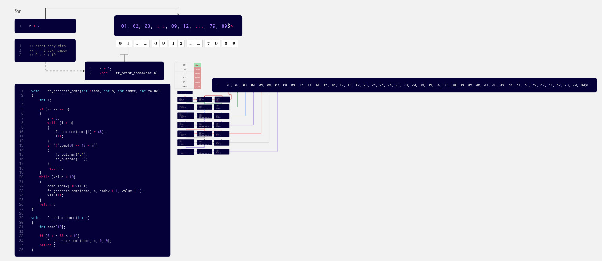
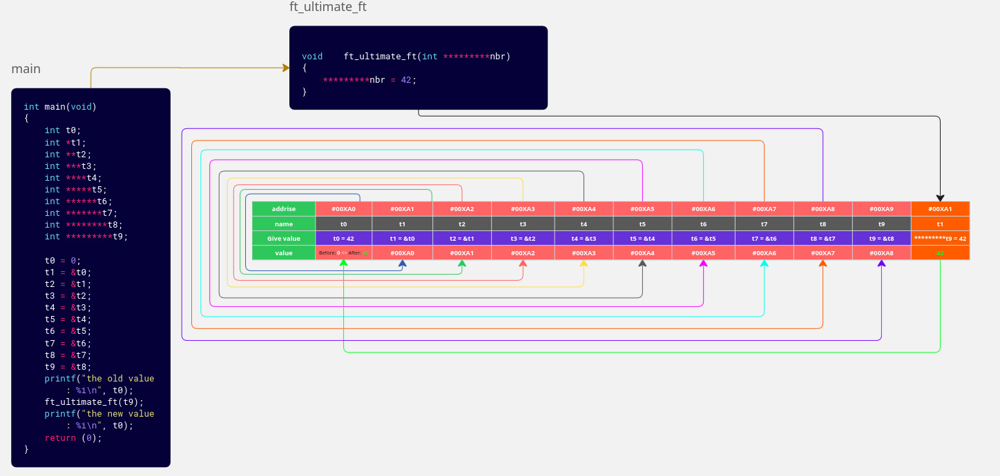
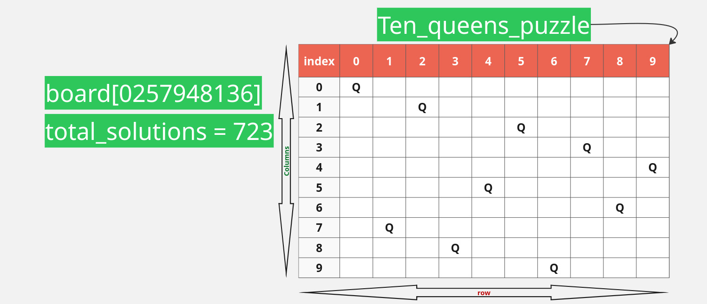

<div align="center">

# 🏊‍♂️ 42 Piscine - Complete Guide & Solutions

*A Comprehensive Resource for 1337/42 Pool Students*

[](https://www.42.fr/)
[](https://en.wikipedia.org/wiki/C_(programming_language))
[](https://github.com/42School/norminette)

**Progress:**  **18/35+ exercises completed**

</div>

---

## 📚 Table of Contents

- [C00 - Basics (9/9 ✅)](#c00---basics)
- [C01 - Pointers (8/8 ✅)](#c01---pointers)
- [C05 - Recursion (2/10+ 🔄)](#c05---recursion)

---

## 🎯 How to Use This Guide

This repository serves as a **complete learning resource** for 42 Piscine students:

✅ **100% working solutions** - All code tested and Norminette compliant  
📚 **Learning approach** - Understand concepts before coding  
💡 **Pro tips** - Avoid common mistakes  
🔍 **Resources** - Links to best learning materials  

---

# C00 - Basics

<div align="center">

**Status: ✅ Complete (9/9)** | **Focus: I/O, Loops, Algorithms**

</div>

## ex00 - ft_putchar
**Difficulty:** ⭐ | **Concepts:** `write()`, basic I/O

### What to Learn
- System call `write(1, &char, 1)` for output
- File descriptors (0=stdin, 1=stdout, 2=stderr)
- The `&` operator to get variable address

### Key Code Pattern
```c
void ft_putchar(char c)
{
    write(1, &c, 1);
}
```

### Tips
- Always include `<unistd.h>` for `write()`
- `write()` needs: (fd, pointer, bytes_count)
- Use `&c` to pass address, not value

---

## ex01 - ft_print_alphabet
**Difficulty:** ⭐ | **Concepts:** Loops, ASCII

### What to Learn
- ASCII values: 'a'=97, 'z'=122
- `while` loop structure
- Character iteration

### Approach
1. Start with `char c = 'a'`
2. Loop while `c <= 'z'`
3. Print and increment

### Common Mistakes
❌ Using `int` instead of `char`  
❌ Forgetting to increment counter  
✅ Simple while loop with character range

---

## ex02 - ft_print_reverse_alphabet
**Difficulty:** ⭐ | **Concepts:** Reverse iteration

### What to Learn
- Counting backwards
- Decrement operator `--`

### Key Difference from ex01
```c
char c = 'z';         // Start at end
while (c >= 'a')      // Loop backwards
{
    ft_putchar(c);
    c--;              // Decrement
}
```

---

## ex03 - ft_print_numbers
**Difficulty:** ⭐ | **Concepts:** Number characters

### What to Learn
- ASCII digits: '0'=48, '9'=57
- Same logic as alphabet, different range

### Pattern
```c
char c = '0';
while (c <= '9')
{
    ft_putchar(c);
    c++;
}
```

---

## ex04 - ft_is_negative
**Difficulty:** ⭐⭐ | **Concepts:** Conditionals

### What to Learn
- `if/else` statements
- Comparison operators: `<`, `>=`
- Function parameter handling

### Logic
```c
if (n >= 0)
    ft_putchar('P');  // Positive
else
    ft_putchar('N');  // Negative
```

### Edge Cases
- Test with: 0, -1, 1, INT_MIN, INT_MAX
- Zero is considered positive (>= 0)

---

## ex05 - ft_print_comb
**Difficulty:** ⭐⭐⭐ | **Concepts:** Nested loops, combinations

### What to Learn
- Triple nested loops
- Ensuring digits are in ascending order
- Formatting output with commas

### Algorithm Strategy
```c
// Three digits: abc where a < b < c
num0 = 0;
while (num0 <= 7)           // Max 7 (because need space for 89)
{
    num1 = num0 + 1;        // Always greater than num0
    while (num1 <= 8)       // Max 8 (need space for 9)
    {
        num2 = num1 + 1;    // Always greater than num1
        while (num2 <= 9)
        {
            // Print: num0, num1, num2
            // Add ", " except for last (789)
        }
    }
}
```

### Key Points
- Convert int to char: `num + 48` or `num + '0'`
- Last combination is "789" - no comma after it
- Check: `if (num0 != 7)` before printing comma

---

## ex06 - ft_print_comb2
**Difficulty:** ⭐⭐⭐ | **Concepts:** Number pairs, digit extraction

### What to Learn
- Printing two 2-digit numbers
- Digit extraction with `/` and `%`
- Format: "00 01, 00 02, ... 98 99"

### Digit Extraction Technique
```c
// For number 42:
tens_digit = 42 / 10;      // = 4
units_digit = 42 % 10;     // = 2

// Print as characters:
ft_putchar(tens_digit + '0');
ft_putchar(units_digit + '0');
```

### Algorithm
```c
num1 = 0;
while (num1 <= 98)
{
    num2 = num1 + 1;        // Second number always > first
    while (num2 <= 99)
    {
        // Print num1 (2 digits)
        // Print space
        // Print num2 (2 digits)
        // Add ", " if not last (98 99)
    }
}
```

---

## ex07 - ft_putnbr
**Difficulty:** ⭐⭐⭐⭐ | **Concepts:** Recursion, INT_MIN

### What to Learn
- Converting integers to strings
- Handling negative numbers
- Special case: `-2147483648` (INT_MIN)
- Recursive digit extraction

### The INT_MIN Problem
```c
// INT_MIN = -2147483648
// If you do: -(-2147483648) = overflow!
// Because INT_MAX = 2147483647

// Solution: Handle as special case
if (nb == -2147483648)
{
    write(1, "-2147483648", 11);
    return;
}
```

### Recursive Approach
```c
void ft_putnbr(int nb)
{
    if (nb == -2147483648)
    {
        write(1, "-2147483648", 11);
        return;
    }
    if (nb < 0)
    {
        ft_putchar('-');
        nb = -nb;
    }
    if (nb > 9)
        ft_putnbr(nb / 10);     // Print higher digits first
    ft_putchar((nb % 10) + '0'); // Then print last digit
}
```

### How It Works
```
Example: 1234

1. nb > 9, so call ft_putnbr(123)
   2. nb > 9, so call ft_putnbr(12)
      3. nb > 9, so call ft_putnbr(1)
         4. nb == 1, print '1'
      3. Print '2' (12 % 10)
   2. Print '3' (123 % 10)
1. Print '4' (1234 % 10)

Output: 1234
```

---

## ex08 - ft_print_combn
**Difficulty:** ⭐⭐⭐⭐⭐ | **Concepts:** Recursion, backtracking

### 📸 Visual Guides

<div align="center">



**For clear interactive viewing:** [View on Miro Board](https://miro.com/welcomeonboard/UExRbVBLUVcvazZWOFFNSkM0ckhTdHFidmRpM2xabjBERzFQSDZwM3VSQU5yc28rK2grNW9SZHptUGd3Q1NZME5ZUWpHVUdFTkFJdG1kREdhRlBlT1YzdnpPUVVkUFdqTzQ0NFNwOTh5TFhYOWp2L2VCK2NhWG4xRlFZdzZkVVJhWWluRVAxeXRuUUgwWDl3Mk1qRGVRPT0hdjE=?share_link_id=203145502666)

*Detailed explanation of recursive combination generation with step-by-step flow*

</div>

### What to Learn
- Recursive backtracking
- Array manipulation
- Dynamic combination generation
- Detecting last combination

### Algorithm Breakdown

**Goal:** Print all combinations of `n` digits in ascending order.

**Example:** n=2 → "01, 02, 03, ..., 89"

### Recursive Strategy
```c
void ft_generate_comb(int *array, int n, int index, int start)
{
    // Base case: array is full
    if (index == n)
    {
        print_array(array, n);
        return;
    }
    
    // Recursive case: try all digits from start to 9
    while (start < 10)
    {
        array[index] = start;
        ft_generate_comb(array, n, index + 1, start + 1);
        start++;
    }
}
```

### Recursion Tree (n=2)
```
                ft_generate([], 2, 0, 0)
                        |
        ┌───────┬───────┼───────┬───────┐
       [0]     [1]     [2]     [3]   ... [9]
        |       |       |       |
     ┌──┼──┐  ┌─┼─┐   ┌─┼─┐   ┌─┼─┐
    [01][02][03][12][13][23][24][34][35]...
     ✓   ✓   ✓   ✓   ✓   ✓   ✓   ✓   ✓
```

### Detecting Last Combination
```c
// For n=3, last is "789"
// Pattern: each digit = (10 - n) + position
// Position 0: 10-3+0 = 7
// Position 1: 10-3+1 = 8
// Position 2: 10-3+2 = 9

int is_last(int *array, int n)
{
    int i = 0;
    while (i < n)
    {
        if (array[i] != (10 - n) + i)
            return (0);
        i++;
    }
    return (1);
}
```

### Complete Solution Pattern
```c
void ft_print_combn(int n)
{
    int array[10];
    
    if (n > 0 && n < 10)
        ft_generate_comb(array, n, 0, 0);
}
```

### Test Cases
```c
ft_print_combn(1); // 0, 1, 2, ..., 9
ft_print_combn(2); // 01, 02, ..., 89
ft_print_combn(3); // 012, 013, ..., 789
ft_print_combn(9); // 012345678, 012345679, ..., 123456789
```

### Resources for ex08
- 📸 Check `combn.jpg`, `combn2.jpg`, `combn3.jpg` for visual explanation
- Study backtracking concept first
- Draw recursion tree on paper
- Test with small n values (1, 2) first

---

# C01 - Pointers

<div align="center">

**Status: ✅ Complete (8/8)** | **Focus: Memory, Pointers, Arrays, Sorting**

</div>

## ex00 - ft_ft
**Difficulty:** ⭐⭐ | **Concepts:** Basic pointers

### What to Learn
- Pointer declaration: `int *ptr`
- Address-of operator: `&variable`
- Dereference operator: `*ptr`

### The Pointer Concept
```c
int value = 10;      // A variable
int *ptr = &value;   // Pointer stores address of value
*ptr = 42;           // Change value through pointer
// Now value == 42
```

### Solution Pattern
```c
void ft_ft(int *nbr)
{
    *nbr = 42;  // Dereference to modify the value
}

// Usage:
int test = 0;
ft_ft(&test);  // Pass address with &
// test is now 42
```

---

## ex01 - ft_ultimate_ft
**Difficulty:** ⭐⭐⭐⭐ | **Concepts:** Multi-level pointers

### 📸 Visual Guide

<div align="center">



**For clear interactive viewing:** [View on Miro Board](https://miro.com/welcomeonboard/NEtOOTh2UFRHdWpYSEdJQmpBMXpTWnlUdVBIVExUL1B4OGJXR3Z4LzRhOXc0LzFLUXl5UzNESmVXWnovN1R3Z0Voc1JmR0VaQW5PQ3FMQUN4YkZwSUYzdnpPUVVkUFdqTzQ0NFNwOTh5TFhqc28vOVFEWTB1bXRkcXNUOEhvblpNakdSWkpBejJWRjJhRnhhb1UwcS9BPT0hdjE=?share_link_id=885149419862)

*Comprehensive visual guide covering:*
- Memory address layout
- Pointer chains and levels
- Dereferencing process step-by-step
- Value vs Address distinction
- Multi-level indirection (pointer to pointer to pointer...)

</div>

### What to Learn
- Pointer to pointer: `int **ptr`
- Multiple levels of indirection
- How memory addresses chain together

### The Challenge
Set a value through **9 levels of pointers**!

### Memory Visualization
```
Level 0: int value = 0            [Address: 0x1000]
Level 1: int *p1 = &value         [Address: 0x2000] → 0x1000
Level 2: int **p2 = &p1           [Address: 0x3000] → 0x2000
Level 3: int ***p3 = &p2          [Address: 0x4000] → 0x3000
...
Level 9: int *********p9 = &p8    [Address: 0xA000] → 0x9000
```

### Solution
```c
void ft_ultimate_ft(int *********nbr)
{
    *********nbr = 42;  // 9 dereferences to reach the value
}

// Setup:
int value = 0;
int *p1 = &value;
int **p2 = &p1;
int ***p3 = &p2;
int ****p4 = &p3;
int *****p5 = &p4;
int ******p6 = &p5;
int *******p7 = &p6;
int ********p8 = &p7;
int *********p9 = &p8;

ft_ultimate_ft(p9);  // value becomes 42
```

### Understanding Dereferences
- `*p9` → gets p8
- `**p9` → gets p7
- `***p9` → gets p6
- ...
- `*********p9` → gets the actual value

---

## ex02 - ft_swap
**Difficulty:** ⭐⭐ | **Concepts:** Swapping values via pointers

### What to Learn
- Why direct swap doesn't work
- Using temporary variable
- Pointer-based value exchange

### The Problem
```c
// ❌ This doesn't work:
void bad_swap(int a, int b)
{
    int temp = a;
    a = b;
    b = temp;
}
// Changes are local, original variables unchanged
```

### The Solution
```c
void ft_swap(int *a, int *b)
{
    int temp = *a;  // Save first value
    *a = *b;        // First gets second's value
    *b = temp;      // Second gets saved first value
}

// Usage:
int x = 5, y = 10;
ft_swap(&x, &y);
// x is now 10, y is now 5
```

### Visual Process
```
Before:    a → [5]    b → [10]
Step 1:    temp = 5
Step 2:    a → [10]   (copied from b)
Step 3:    b → [5]    (from temp)
After:     a → [10]   b → [5]
```

---

## ex03 - ft_div_mod
**Difficulty:** ⭐⭐ | **Concepts:** Multiple return values

### What to Learn
- C functions return only one value
- Use pointers to "return" multiple values
- Integer division vs modulo

### The Concept
```c
// Division: 9 / 2 = 4
// Modulo:   9 % 2 = 1
```

### Solution Pattern
```c
void ft_div_mod(int a, int b, int *div, int *mod)
{
    *div = a / b;  // Store quotient
    *mod = a % b;  // Store remainder
}

// Usage:
int division, modulo;
ft_div_mod(9, 2, &division, &modulo);
// division = 4, modulo = 1
```

### Why Pointers?
```c
// ❌ Can't do this:
return (div, mod);  // Syntax error

// ✅ Must use pointers:
*div = result1;
*mod = result2;
```

---

## ex04 - ft_ultimate_div_mod
**Difficulty:** ⭐⭐⭐ | **Concepts:** In-place modification

### What to Learn
- Modifying both input parameters
- Need for temporary variable
- Order of operations matters

### The Challenge
Use the **same two variables** for input AND output!

### The Trap
```c
// ❌ Wrong - loses original value:
void wrong(*a, *b)
{
    *a = *a / *b;  // Original *a is lost!
    *b = ???;      // Can't calculate modulo now
}
```

### Correct Solution
```c
void ft_ultimate_div_mod(int *a, int *b)
{
    int temp = *a;      // Save original *a
    *a = *a / *b;       // Division result in *a
    *b = temp % *b;     // Modulo result in *b (using saved value)
}

// Usage:
int x = 9, y = 2;
ft_ultimate_div_mod(&x, &y);
// x = 4 (9/2), y = 1 (9%2)
```

### Order Matters
```
Original: a=9, b=2
temp = 9        (save a)
a = 9 / 2 = 4   (now a is changed)
b = 9 % 2 = 1   (use saved temp, not current a!)
Result: a=4, b=1
```

---

## ex05 - ft_putstr
**Difficulty:** ⭐⭐ | **Concepts:** Strings, array iteration

### What to Learn
- Strings are arrays of characters
- Null terminator `\0` marks the end
- Array indexing: `str[i]`

### String in Memory
```c
char str[] = "Hello";
// Memory: ['H']['e']['l']['l']['o']['\0']
// Index:    0    1    2    3    4    5
```

### Solution Pattern
```c
void ft_putstr(char *str)
{
    int i = 0;
    while (str[i] != '\0')  // or just: while (str[i])
    {
        write(1, &str[i], 1);
        i++;
    }
}
```

### Alternative: Pointer Arithmetic
```c
void ft_putstr(char *str)
{
    while (*str)        // Check current character
    {
        write(1, str, 1);
        str++;          // Move to next character
    }
}
```

---

## ex06 - ft_strlen
**Difficulty:** ⭐⭐ | **Concepts:** String length, counting

### What to Learn
- Counting until null terminator
- Return vs print
- String traversal

### Solution Pattern
```c
int ft_strlen(char *str)
{
    int i = 0;
    while (str[i])
        i++;
    return (i);  // Return count, don't print
}

// Test:
int len = ft_strlen("Hello");  // len = 5
```

### Common Mistake
```c
// ❌ Wrong:
void ft_strlen(char *str)  // void instead of int
{
    // Count...
    ft_putnbr(count);      // Don't print!
}

// ✅ Correct:
int ft_strlen(char *str)   // Return int
{
    // Count...
    return (count);        // Return the value
}
```

---

## ex07 - ft_rev_int_tab
**Difficulty:** ⭐⭐⭐ | **Concepts:** Array reversal, swapping

### What to Learn
- Reversing array in-place
- Two-pointer technique
- Array bounds

### Algorithm Strategy
```
Array: [1, 2, 3, 4, 5]
       ↑           ↑
      left       right

Step 1: Swap 1 and 5 → [5, 2, 3, 4, 1]
                  ↑       ↑
                left     right

Step 2: Swap 2 and 4 → [5, 4, 3, 2, 1]
                     ↑  ↑
                   left/right meet → stop
```

### Solution Pattern
```c
void ft_rev_int_tab(int *tab, int size)
{
    int left = 0;
    int right = size - 1;
    int temp;
    
    while (left < right)
    {
        // Swap tab[left] and tab[right]
        temp = tab[left];
        tab[left] = tab[right];
        tab[right] = temp;
        
        // Move pointers
        left++;
        right--;
    }
}
```

### Test Case
```c
int arr[] = {1, 2, 3, 4, 5};
ft_rev_int_tab(arr, 5);
// Result: {5, 4, 3, 2, 1}
```

---

## ex08 - ft_sort_int_tab
**Difficulty:** ⭐⭐⭐⭐ | **Concepts:** Sorting, Bubble Sort

### What to Learn
- Sorting algorithms (bubble sort)
- In-place sorting
- Nested loops for comparison

### Algorithm Strategy
```c
void ft_sort_int_tab(int *tab, int size)
{
    int i = 0;
    int j;
    int temp;
    
    while (i < size - 1)
    {
        j = 0;
        while (j < size - 1 - i)
        {
            if (tab[j] > tab[j + 1])
            {
                temp = tab[j];
                tab[j] = tab[j + 1];
                tab[j + 1] = temp;
            }
            j++;
        }
        i++;
    }
}
```

### How Bubble Sort Works
```
Initial: [3, 1, 6, 2, 4, 8, 5, 7]

Pass 1:  [1, 3, 2, 4, 6, 5, 7, 8]  // 8 sorted
Pass 2:  [1, 2, 3, 4, 5, 6, 7, 8]  // 7,8 sorted
... until fully sorted
```

### Key Points
- **Bubble sort**: compares adjacent elements and swaps if needed
- After each pass, the largest element "bubbles" to the end
- **Optimization**: inner loop reduces by `i` each pass
- **Stable sort**: equal elements keep original order

### Visualization
```
Step-by-step for [3, 1, 6, 2]:

1. Compare 3 and 1 → swap: [1, 3, 6, 2]
2. Compare 3 and 6 → no swap: [1, 3, 6, 2]
3. Compare 6 and 2 → swap: [1, 3, 2, 6]
4. Next pass: compare 1 and 3 → no swap
5. Compare 3 and 2 → swap: [1, 2, 3, 6]
6. Final: [1, 2, 3, 6] sorted!
```

### Code with Helper Function
```c
void ft_swap(int *a, int *b)
{
    int temp = *a;
    *a = *b;
    *b = temp;
}

void ft_sort_int_tab(int *tab, int size)
{
    int i = 0;
    int j;
    
    while (i < size - 1)
    {
        j = 0;
        while (j < size - 1 - i)
        {
            if (tab[j] > tab[j + 1])
                ft_swap(&tab[j], &tab[j + 1]);
            j++;
        }
        i++;
    }
}
```

### Performance
- **Time Complexity**: O(n²) worst/average case
- **Space Complexity**: O(1) in-place
- **Best for**: Small arrays or nearly sorted data

---

# C05 - Recursion

<div align="center">

**Status: 🔄 In Progress (2/10+)** | **Focus: Recursion, Algorithms**

</div>

## ex00 - ft_iterative_factorial
**Difficulty:** ⭐⭐ | **Concepts:** Factorial, iteration

### What to Learn
- Factorial definition: n! = n × (n-1) × ... × 2 × 1
- Edge cases: 0! = 1, negative = 0
- Overflow concerns

### Mathematical Definition
```
5! = 5 × 4 × 3 × 2 × 1 = 120
4! = 4 × 3 × 2 × 1 = 24
3! = 3 × 2 × 1 = 6
2! = 2 × 1 = 2
1! = 1
0! = 1 (by definition)
```

### Solution Pattern
```c
int ft_iterative_factorial(int nb)
{
    int result = 1;
    
    if (nb < 0)
        return (0);      // Undefined for negative
    if (nb == 0)
        return (1);      // 0! = 1
    
    while (nb > 1)
    {
        result *= nb;
        nb--;
    }
    return (result);
}
```

### Edge Cases
```c
ft_iterative_factorial(-5);  // → 0
ft_iterative_factorial(0);   // → 1
ft_iterative_factorial(1);   // → 1
ft_iterative_factorial(5);   // → 120
ft_iterative_factorial(13);  // Overflow risk!
```

---

## ex08 - ft_ten_queens_puzzle
**Difficulty:** ⭐⭐⭐⭐⭐ | **Concepts:** Backtracking, N-Queens

### 📸 Visual Guide

<div align="center">



**For clear interactive viewing:** [View on Miro Board](https://miro.com/welcomeonboard/NDRDRWNEcjNiellKUStLQ21oMU1lTXJIYnMzeWZRbmZiQ09scmpZcW5nMnNLTnRBMDR5bjJiWVpvNmdvTDVzM1hmLzZVU2RMWmtoNzdyZHUwS2pnMlYzdnpPUVVkUFdqTzQ0NFNwOTh5TFYvT2VKdDRkemdCYlYwZVQ2bmE2RnpBd044SHFHaVlWYWk0d3NxeHNmeG9BPT0hdjE=?share_link_id=344043658286)

*Complete backtracking algorithm visualization with:*
- Chessboard representation
- Valid queen placement rules
- Backtracking decision tree
- Algorithm flow and recursion
- Solution visualization

</div>

### What to Learn
- Classic backtracking problem
- Constraint satisfaction
- Board representation
- Conflict detection

### The Problem
Place 10 queens on a 10×10 chessboard so that:
- No two queens share the same row
- No two queens share the same column
- No two queens share the same diagonal

### Board Representation
```c
// Instead of 10×10 array, use 1D array:
// board[col] = row
// Example: board[0] = 3 means queen at column 0, row 3

int board[10];
// board[0] = row of queen in column 0
// board[1] = row of queen in column 1
// etc.
```

### Conflict Detection
```c
int is_valid(int *board, int row, int col)
{
    int i = 0;
    
    while (i < col)  // Check all previously placed queens
    {
        // Same row?
        if (board[i] == row)
            return (0);
        
        // Same diagonal?
        // If |row difference| == |column difference|
        if (abs(board[i] - row) == abs(i - col))
            return (0);
        
        i++;
    }
    return (1);  // No conflicts
}
```

### Diagonal Check Explained
```
If two queens are on same diagonal:
  |row1 - row2| == |col1 - col2|

Example:
  Queen 1 at (2,1)  Queen 2 at (4,3)
  |2 - 4| = 2
  |1 - 3| = 2
  → Same diagonal!
```

### Backtracking Algorithm
```c
int solve_helper(int *board, int col)
{
    int solutions = 0;
    
    // Base case: placed all queens
    if (col >= 10)
    {
        print_solution(board);
        return (1);
    }
    
    // Try each row for this column
    int row = 0;
    while (row < 10)
    {
        if (is_valid(board, row, col))
        {
            board[col] = row;     // Place queen
            solutions += solve_helper(board, col + 1);  // Recurse
            board[col] = -1;      // Backtrack
        }
        row++;
    }
    return (solutions);
}
```

### Complete Solution
```c
int ft_ten_queens_puzzle(void)
{
    int board[10];
    int i = 0;
    
    // Initialize board
    while (i < 10)
    {
        board[i] = -1;
        i++;
    }
    
    return solve_helper(board, 0);
}
```

### Output Format
```c
void print_solution(int *board)
{
    int i = 0;
    while (i < 10)
    {
        write(1, &"0123456789"[board[i]], 1);
        i++;
    }
    write(1, "\n", 1);
}

// Example output:
// 0257948136
// 0258639741
// ...
// (each line is one valid solution)
```

### Recursion Tree (Simplified for 4-Queens)
```
                    Col 0
         ┌──────┬────┴────┬──────┐
        R0     R1        R2      R3
         ×      |         |       ×
              Col 1     Col 1
           ┌──┬─┴─┬──┐    ...
           R0 R1 R2 R3
           ×  ×  |  ×
              Col 2
             (continue...)
```

### Key Insights
1. **One queen per column** - we iterate columns, try rows
2. **Check before place** - validate position before recursing
3. **Backtrack** - reset board[col] after recursion returns
4. **Count solutions** - there are 724 solutions for 10-Queens

### Resources
- 📸 See `ten_queens_puzzel.jpg` for visual explanation
- Practice with 4-Queens first (easier to visualize)
- Draw the decision tree on paper
- Understand backtracking before coding

---

## 📖 Learning Resources

### Essential Reading
- **Pointers:** [C Pointers Explained](https://www.programiz.com/c-programming/c-pointers)
- **Recursion:** [Recursion in C](https://www.geeksforgeeks.org/recursion-in-c/)
- **Backtracking:** [Backtracking Algorithm](https://www.geeksforgeeks.org/backtracking-algorithms/)
- **Sorting:** [Bubble Sort Algorithm](https://www.geeksforgeeks.org/bubble-sort/)

### Practice Platforms
- [HackerRank C](https://www.hackerrank.com/domains/c)
- [LeetCode Easy](https://leetcode.com/problemset/all/?difficulty=Easy)
- [Sorting Visualizer](https://www.toptal.com/developers/sorting-algorithms)

### Books
- **The C Programming Language** - Kernighan & Ritchie
- **C Programming: A Modern Approach** - K. N. King
- **Algorithms in C** - Robert Sedgewick

---

## 🛠️ Compilation & Testing

### Standard Compilation
```bash
gcc -Wall -Wextra -Werror file.c -o program
```

### Running Tests
```bash
./program          # Basic test
./program "test"   # With arguments
```

### Check Norminette
```bash
norminette file.c
```

### Test Sorting Functions
```bash
# Create test array
echo "Testing ft_sort_int_tab:"
echo "Original: 3 1 6 2 4 8 5 7"
# Compile with test file
gcc -Wall -Wextra -Werror test_sort.c ft_sort_int_tab.c -o test_sort
./test_sort
```

---

## ✅ Progress Tracker

| Day | Exercise | Status | Difficulty |
|:---:|:---------|:------:|:----------:|
| C00 | ex00 - ft_putchar | ✅ | ⭐ |
| C00 | ex01 - ft_print_alphabet | ✅ | ⭐ |
| C00 | ex02 - ft_print_reverse_alphabet | ✅ | ⭐ |
| C00 | ex03 - ft_print_numbers | ✅ | ⭐ |
| C00 | ex04 - ft_is_negative | ✅ | ⭐⭐ |
| C00 | ex05 - ft_print_comb | ✅ | ⭐⭐⭐ |
| C00 | ex06 - ft_print_comb2 | ✅ | ⭐⭐⭐ |
| C00 | ex07 - ft_putnbr | ✅ | ⭐⭐⭐⭐ |
| C00 | ex08 - ft_print_combn | ✅ | ⭐⭐⭐⭐⭐ |
| C01 | ex00 - ft_ft | ✅ | ⭐⭐ |
| C01 | ex01 - ft_ultimate_ft | ✅ | ⭐⭐⭐⭐ |
| C01 | ex02 - ft_swap | ✅ | ⭐⭐ |
| C01 | ex03 - ft_div_mod | ✅ | ⭐⭐ |
| C01 | ex04 - ft_ultimate_div_mod | ✅ | ⭐⭐⭐ |
| C01 | ex05 - ft_putstr | ✅ | ⭐⭐ |
| C01 | ex06 - ft_strlen | ✅ | ⭐⭐ |
| C01 | ex07 - ft_rev_int_tab | ✅ | ⭐⭐⭐ |
| C01 | ex08 - ft_sort_int_tab | ✅ | ⭐⭐⭐⭐ |
| C05 | ex00 - ft_iterative_factorial | ✅ | ⭐⭐ |
| C05 | ex08 - ft_ten_queens_puzzle | ✅ | ⭐⭐⭐⭐⭐ |

**Total: 18/35+ exercises completed**

---

<div align="center">

## 💭 Study Tips

**📌 Before You Start:**
1. Read the subject PDF carefully (twice!)
2. Understand the concept before coding
3. Draw diagrams for complex problems
4. Test with edge cases

**⚠️ Common Mistakes to Avoid:**
- Not handling edge cases (0, negative, INT_MIN)
- Memory leaks and uninitialized pointers
- Off-by-one errors in loops
- Forgetting null terminator in strings
- Not testing sorting with duplicate values

**✅ Best Practices:**
- Write clean, readable code
- Comment complex logic
- Test thoroughly before submitting
- Use `norminette` before every push
- For sorting: test with random, sorted, reverse-sorted arrays

</div>

---

<div align="center">

**"The only way to learn a new programming language is by writing programs in it."**  
*- Dennis Ritchie*

---

**By: Itachi-Logic** <ILogic@student.1337.ma>

[](https://github.com/Itachi-Logic)

*Good luck with your Piscine! 🏊‍♂️*

---

*Last Updated: December 2025*

</div>
