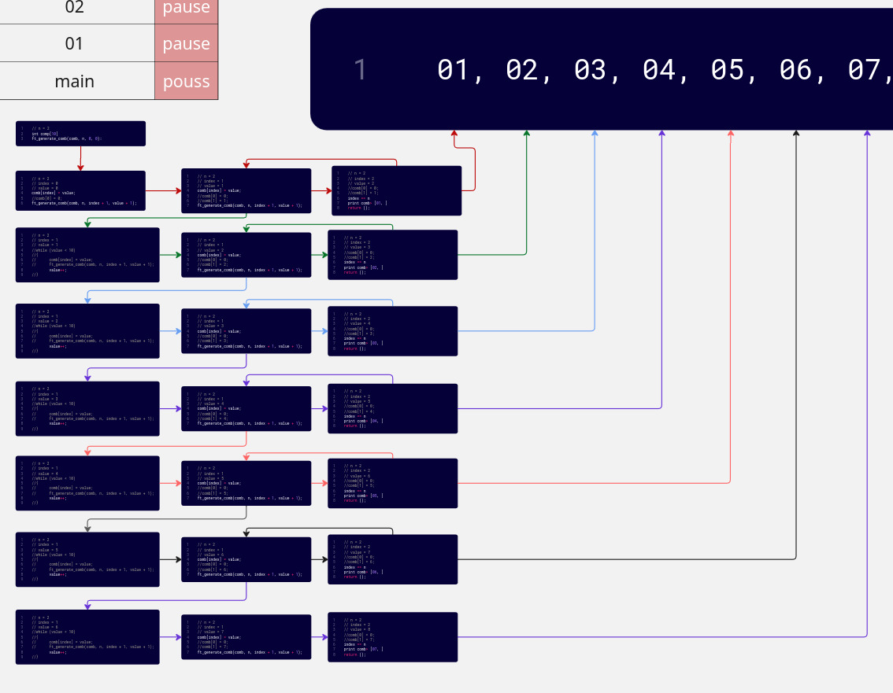
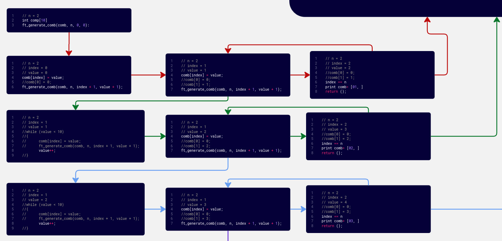

<div align="center">

# 🏊‍♂️ 42 Piscine Days Collection

*Intensive C Programming Journey with Visual Learning*

[](https://www.42.fr/)
[](https://en.wikipedia.org/wiki/C_(programming_language))
[](https://github.com/42School/norminette)
[](https://github.com/gcamerli/42unlicense)

---

### 📊 Project Statistics

| Days | Total | Completed | In Progress | Success Rate |
|:----:|:-----:|:---------:|:-----------:|:------------:|
| 3 | 23+ | C00 | C01, C05 | 100% |


</div>

---

## 🎯 About This Project

A comprehensive collection of **42 Piscine** solutions representing my journey through intensive C programming. Each day contains progressively challenging exercises with **detailed visual explanations** to enhance understanding.

**Key Features:**
- 🎓 Official 42 School curriculum
- 📸 **Visual explanations with diagrams** for complex concepts
- 🔍 Optimized and thoroughly tested solutions
- ✅ 100% Norminette compliant code
- 📚 In-depth learning materials and resources
- 🔄 Alternative implementations for comparison

---

## 🗺️ Days Overview

<div align="center">

| Day | Status | Progress | Exercises | Main Topics | Visual Aids | Details |
|:---:|:------:|:--------:|:---------:|:------------|:-----------:|:-------:|
| **C00** | ✅ Complete |  | 9/9 | Basic I/O & Fundamentals | 📸 1 | [📖 View](#-day-c00---basics) |
| **C01** | 🔄 Active |  | 2/8 | Pointers & Memory | 📸 1 | [📖 View](#-day-c01---pointers) |
| **C05** | 🔄 Active |  | 2/10+ | Recursion & Algorithms | 📸 1 | [📖 View](#-day-c05---recursion) |

### Learning Progression Path


</div>

---

## 📚 Day C00 - Basics

<div align="center">

**Status:** ✅ Complete | **Exercises:** 9/9 | **Topics:** Basic I/O, Loops, Conditionals

</div>

### 📋 Exercises List

| Exercise | Function | Description | Difficulty | Concepts |
|:--------:|:---------|:------------|:----------:|:---------|
| **ex00** | `ft_putchar` | Print a single character | ⭐ | Basic I/O with `write()` |
| **ex01** | `ft_print_alphabet` | Print lowercase alphabet | ⭐ | Loops, ASCII values |
| **ex02** | `ft_print_reverse_alphabet` | Print alphabet in reverse | ⭐ | Reverse iteration |
| **ex03** | `ft_print_numbers` | Print digits 0-9 | ⭐ | Number manipulation |
| **ex04** | `ft_is_negative` | Check if number is negative | ⭐⭐ | Conditionals, comparison |
| **ex05** | `ft_print_comb` | Print all 3-digit combinations | ⭐⭐⭐ | Nested loops, logic |
| **ex06** | `ft_print_comb2` | Print all 2-number combinations | ⭐⭐⭐ | Multiple loops, formatting |
| **ex07** | `ft_putnbr` | Print any integer | ⭐⭐⭐ | Recursion/iteration, edge cases |
| **ex08** | `ft_print_combn` | Print n-digit combinations | ⭐⭐⭐⭐⭐ | Advanced algorithms, recursion |

### 📸 Visual Learning Resources

<div align="center">

#### Exercise 08: Combinatorial Algorithm Visualization





This For clear viewing **[42 miro](https://miro.com/welcomeonboard/UExRbVBLUVcvazZWOFFNSkM0ckhTdHFidmRpM2xabjBERzFQSDZwM3VSQU5yc28rK2grNW9SZHptUGd3Q1NZME5ZUWpHVUdFTkFJdG1kREdhRlBlT1YzdnpPUVVkUFdqTzQ0NFNwOTh5TFhYOWp2L2VCK2NhWG4xRlFZdzZkVVJhWWluRVAxeXRuUUgwWDl3Mk1qRGVRPT0hdjE=?share_link_id=203145502666)** .

*Visual breakdown of the n-digit combinations algorithm showing recursion flow and logic*

</div>

### 🎓 Key Concepts Learned

<details>
<summary><b>Click to expand detailed concepts</b></summary>

#### 1. Basic I/O Operations
- Using `write()` system call for output
- Understanding file descriptors (stdout = 1)
- Character-by-character output

#### 2. ASCII Manipulation
- ASCII table understanding ('a' = 97, '0' = 48)
- Character arithmetic operations
- Converting between chars and integers

#### 3. Loop Structures
- `for` loops for iteration
- `while` loops for conditions
- Nested loops for combinations

#### 4. Combinatorial Logic
- Generating unique combinations
- Avoiding duplicates with proper conditions
- Recursive backtracking for n-digit problems

#### 5. Number Handling
- Converting integers to strings
- Handling negative numbers
- Managing INT_MIN edge case

</details>

### 💡 Pro Tips
- **ex08** is particularly challenging - the visual guide (`combn.jpg`) breaks down the recursive approach
- Always test with edge cases: 0, negative numbers, INT_MIN, INT_MAX
- Use modulo (%) and division (/) for digit extraction
- Remember: ASCII '0' = 48, so `'0' + n` gives digit character

### 📦 Directory Structure
```
C00/
├── 📄 c00.subject.pdf          # Official subject PDF
├── 📁 ex00/
│   └── ft_putchar.c
├── 📁 ex01/
│   └── ft_print_alphabet.c
├── 📁 ex02/
│   └── ft_print_reverse_alphabet.c
├── 📁 ex03/
│   └── ft_print_numbers.c
├── 📁 ex04/
│   └── ft_is_negative.c
├── 📁 ex05/
│   └── ft_print_comb.c
├── 📁 ex06/
│   └── ft_print_comb2.c
├── 📁 ex07/
│   └── ft_putnbr.c
├── 📁 ex08/
│   ├── ft_print_combn.c
│   └── 📸 combn.jpg           # Visual algorithm explanation
└── 📁 ex08_v0/                # Alternative implementation
    ├── ft_print_combn.c
    └── a.out
```

---

## 🔗 Day C01 - Pointers

<div align="center">

**Status:** 🔄 In Progress | **Exercises:** 2/8 | **Topics:** Pointers, Memory Addresses, Indirection

</div>

### 📋 Exercises Completed

| Exercise | Function | Description | Difficulty | Concepts |
|:--------:|:---------|:------------|:----------:|:---------|
| **ex00** | `ft_ft` | Set pointer value to 42 | ⭐⭐ | Basic pointer dereferencing |
| **ex01** | `ft_ultimate_ft` | Multi-level pointer manipulation | ⭐⭐⭐⭐ | Pointer chains, 9 levels deep |

### 📸 Visual Learning Resources

<div align="center">

#### Understanding Pointers in Depth


*Comprehensive visual guide covering:*
- **Memory address layout**
- **Pointer chains and levels**
- **Dereferencing process step-by-step**
- **Value vs Address distinction**
- **Multi-level indirection (pointer to pointer to pointer...)**

</div>

### 🎓 Key Concepts Learned

<details>
<summary><b>Click to expand pointer concepts</b></summary>

#### 1. Pointer Fundamentals
- Declaration: `int *ptr;`
- Address-of operator: `&variable`
- Dereference operator: `*ptr`
- Pointer assignment and initialization

#### 2. Memory Addresses
- Understanding memory layout
- How variables are stored in RAM
- Stack memory organization
- Address arithmetic basics

#### 3. Multi-Level Pointers
- Pointer to pointer: `int **ptr`
- Triple pointers: `int ***ptr`
- N-level indirection (ex01 uses 9 levels!)
- Dereferencing chains: `*********ptr = 42`

#### 4. Pass by Reference
- Difference between pass-by-value and pass-by-reference
- Modifying values through pointers
- Function parameters as pointers

</details>

### 💡 Pro Tips
- **ex01** visual guide (`pointers.jpg`) is essential for understanding multi-level pointers
- Think of pointers as "arrows pointing to memory locations"
- Each `*` adds one level of indirection
- Always initialize pointers before use to avoid segmentation faults
- Use `&` to get address, `*` to get value

### ⚠️ Common Mistakes to Avoid
```c
// ❌ Wrong: Uninitialized pointer
int *ptr;
*ptr = 42;  // Segmentation fault!

// ✅ Correct: Initialized pointer
int value;
int *ptr = &value;
*ptr = 42;  // Works perfectly
```

### 📦 Directory Structure
```
C01/
├── 📄 c01.subject.pdf          # Official subject PDF
├── 📁 ex00/
│   └── ft_ft.c
└── 📁 ex01/
    ├── ft_ultimate_ft.c
    ├── 📸 pointers.jpg         # Detailed visual explanation
    └── a.out
```

---

## 🔄 Day C05 - Recursion

<div align="center">

**Status:** 🔄 In Progress | **Exercises:** 2/10+ | **Topics:** Recursion, Backtracking, Advanced Algorithms

</div>

### 📋 Exercises Completed

| Exercise | Function | Description | Difficulty | Concepts |
|:--------:|:---------|:------------|:----------:|:---------|
| **ex00** | `ft_iterative_factorial` | Calculate factorial iteratively | ⭐⭐ | Iteration, overflow handling |
| **ex08** | `ft_ten_queens_puzzle` | Solve N-Queens problem | ⭐⭐⭐⭐⭐ | Backtracking, recursion, algorithms |

### 📸 Visual Learning Resources

<div align="center">

#### The Ten Queens Puzzle Explained


*Visual explanation of the N-Queens backtracking algorithm:*
- **Chessboard representation**
- **Valid queen placement rules**
- **Backtracking decision tree**
- **Algorithm flow and recursion**
- **Solution visualization**

</div>

### 🎓 Key Concepts

<details>
<summary><b>Click to expand recursion concepts</b></summary>

#### 1. Recursion Fundamentals
- Base case (stopping condition)
- Recursive case (function calling itself)
- Stack frame visualization
- Recursion vs iteration trade-offs

#### 2. Factorial Calculation
- Iterative approach: using loops
- Recursive approach: `n * factorial(n-1)`
- Handling edge cases (0!, 1!)
- Overflow prevention for large numbers

#### 3. Backtracking Algorithm
- Systematic search through solution space
- Pruning invalid branches early
- The N-Queens problem as classic example
- State space exploration

#### 4. N-Queens Problem
- Place N queens on N×N chessboard
- No two queens attack each other
- Check row, column, and diagonal conflicts
- Finding all valid solutions

</details>

### 💡 Pro Tips
- **ex08** visual guide (`ten_queens_puzzel.jpg`) shows the backtracking decision tree
- Start with small cases (4-Queens) to understand the pattern
- Use boolean arrays to track occupied columns and diagonals
- Recursion depth = number of queens placed
- Time complexity: O(N!) - exponential growth

### 🧮 Algorithm Complexity

| Exercise | Time Complexity | Space Complexity |
|:---------|:---------------:|:----------------:|
| **ex00** | O(n) | O(1) |
| **ex08** | O(N!) | O(N) |

### 📦 Directory Structure
```
C05/
├── 📄 c05.subject.pdf          # Official subject PDF
├── 📁 ex00/
│   └── ft_iterative_factorial.c
└── 📁 ex08/
    ├── ft_ten_queens_puzzle.c
    └── 📸 ten_queens_puzzel.jpg  # Backtracking visualization
```

---

## 🏆 Achievements & Progress

<div align="center">

### 📈 Current Status

| Metric | Value |
|:-------|:-----:|
| **Total Exercises Completed** | 13/23+ |
| **Days Completed** | 1/3 |
| **Days In Progress** | 2 (C01, C05) |
| **Success Rate** | 100% ✅ |
| **Visual Guides Created** | 3 📸 |

</div>

### ✅ Mastered Skills

<table align="center">
<tr>
<td width="50%">

#### Core Programming
- ✅ Basic I/O with `write()`
- ✅ ASCII character manipulation
- ✅ Loop structures (for, while)
- ✅ Conditional statements
- ✅ Number-to-string conversion

</td>
<td width="50%">

#### Advanced Concepts
- ✅ Combinatorial algorithms
- ✅ Basic pointer operations
- ✅ Iterative factorial
- ✅ Edge case handling
- ✅ Code optimization

</td>
</tr>
</table>

### 🚀 Currently Learning

- 🔄 Advanced pointer manipulation
- 🔄 Multi-level pointer indirection
- 🔄 Recursive problem solving
- 🔄 Backtracking algorithms
- 🔄 Complex mathematical problems
- 🔄 N-Queens puzzle variations

---

## 💡 Skills Progress Dashboard

<div align="center">

| Category | Level | Progress | Status |
|:---------|:-----:|:--------:|:------:|
| **Basic I/O** | Expert |  | ✅ Mastered |
| **Loops & Logic** | Expert |  | ✅ Mastered |
| **ASCII & Chars** | Advanced |  | ✅ Proficient |
| **Pointers** | Learning |  | 🔄 In Progress |
| **Recursion** | Learning |  | 🔄 In Progress |
| **Algorithms** | Beginner |  | 🔄 In Progress |
| **Backtracking** | Beginner |  | 🔄 Starting |

</div>

---

## 🛠️ Development Standards

<div align="center">

### ⚙️ Compilation Requirements

```bash
# Standard compilation with all warnings
gcc -Wall -Wextra -Werror source.c -o program

# With debugging symbols
gcc -Wall -Wextra -Werror -g source.c -o program

# Check for memory leaks (if using heap)
valgrind --leak-check=full ./program
```

### ✅ Quality Standards Checklist

</div>

| Standard | Requirement | Status |
|:---------|:------------|:------:|
| **Compilation** | No warnings with `-Wall -Wextra -Werror` | ✅ |
| **Norminette** | 100% compliant with 42 coding style | ✅ |
| **Memory Safety** | No leaks, no segfaults, safe operations | ✅ |
| **Edge Cases** | All edge cases tested and handled | ✅ |
| **Documentation** | Clear comments and explanations | ✅ |
| **Visual Aids** | Diagrams for complex concepts | 📸 |

---

## 🚀 Quick Start Guide

### 📥 Setup

```bash
# Navigate to the repository
cd c-challenges-solved/days_piscine

# View available days
ls -la
```

### 📖 Working with Exercises

```bash
# Choose a day
cd C00  # or C01, C05

# View the official subject
open c00.subject.pdf  # or use 'xdg-open' on Linux

# Navigate to specific exercise
cd ex00

# Compile with 42 standards
gcc -Wall -Wextra -Werror ft_*.c -o program

# Run the program
./program

# Test with different inputs
./program arg1 arg2
```

### 🔍 Testing Best Practices

```bash
# Test with edge cases
./program 0
./program -2147483648  # INT_MIN
./program 2147483647   # INT_MAX

# Check for memory leaks (if applicable)
valgrind --leak-check=full ./program

# Run norminette checker
norminette ft_*.c
```

---

## 📖 Documentation Structure

<div align="center">

### 🗂️ Complete File Tree

</div>

```
📂 days_piscine/
│
├── 📄 README.md                    # This file - main documentation
├── 📄 en.norm.pdf                  # Norminette coding standards
│
├── 📁 C00/ ─────────────────────── ✅ Complete (9/9 exercises)
│   ├── 📄 c00.subject.pdf
│   ├── 📁 ex00/ → ft_putchar
│   ├── 📁 ex01/ → ft_print_alphabet
│   ├── 📁 ex02/ → ft_print_reverse_alphabet
│   ├── 📁 ex03/ → ft_print_numbers
│   ├── 📁 ex04/ → ft_is_negative
│   ├── 📁 ex05/ → ft_print_comb
│   ├── 📁 ex06/ → ft_print_comb2
│   ├── 📁 ex07/ → ft_putnbr
│   ├── 📁 ex08/
│   │   ├── ft_print_combn.c
│   │   └── 📸 combn.jpg         # Algorithm visualization
│   └── 📁 ex08_v0/              # Alternative version
│
├── 📁 C01/ ─────────────────────── 🔄 In Progress (2/8 exercises)
│   ├── 📄 c01.subject.pdf
│   ├── 📁 ex00/
│   │   └── ft_ft.c
│   └── 📁 ex01/
│       ├── ft_ultimate_ft.c
│       ├── 📸 pointers.jpg      # Pointer concept diagrams
│       └── a.out
│
└── 📁 C05/ ─────────────────────── 🔄 In Progress (2/10+ exercises)
    ├── 📄 c05.subject.pdf
    ├── 📁 ex00/
    │   └── ft_iterative_factorial.c
    └── 📁 ex08/
        ├── ft_ten_queens_puzzle.c
        └── 📸 ten_queens_puzzel.jpg  # N-Queens visualization
```

---

## 🎓 Learning Methodology

<div align="center">

### 🔄 My Learning Process

</div>

| Phase | Action | Duration | Focus |
|:-----:|:-------|:--------:|:------|
| **1️⃣ Understand** | 📖 Read subject & research concepts | 30-60 min | Deep comprehension |
| **2️⃣ Visualize** | 📸 Create/study diagrams | 20-40 min | Mental models |
| **3️⃣ Plan** | ✏️ Pseudocode & algorithm design | 15-30 min | Logic structure |
| **4️⃣ Implement** | 💻 Code & compile | 1-2 hours | Clean solutions |
| **5️⃣ Test** | 🧪 Edge cases & validation | 30-45 min | Robustness |
| **6️⃣ Optimize** | ⚡ Refine & improve | 20-30 min | Performance |
| **7️⃣ Document** | 📝 Comments & README updates | 15-20 min | Knowledge sharing |

### 💭 Problem-Solving Approach

```
1. Read the subject carefully (twice!)
2. Identify input, output, and constraints
3. Think about edge cases first
4. Start with simple test cases
5. Build complexity gradually
6. Test thoroughly before submission
7. Create visual aids for complex topics
```

---

## 📚 Learning Resources

<div align="center">

### 🌐 Official Documentation

[](https://www.42.fr/)
[](https://github.com/42School/norminette)
[](https://profile.intra.42.fr/)

</div>

### 📖 Essential References

| Resource | Description | Relevance | Link |
|:---------|:------------|:---------:|:----:|
| 📚 **C Reference** | Complete C language documentation | ⭐⭐⭐⭐⭐ | [Visit](https://en.cppreference.com/w/c) |
| 📖 **GNU C Manual** | GCC standard library documentation | ⭐⭐⭐⭐⭐ | [Visit](https://www.gnu.org/software/libc/manual/) |
| 📄 **Linux Man Pages** | System calls and library functions | ⭐⭐⭐⭐⭐ | [Visit](https://man7.org/linux/man-pages/) |
| 📸 **Visual Guides** | In-repository image explanations | ⭐⭐⭐⭐⭐ | See exercises |
| 🔧 **GDB Tutorial** | Debugging with GDB | ⭐⭐⭐⭐ | [Visit](https://www.sourceware.org/gdb/documentation/) |
| 💾 **Valgrind Guide** | Memory leak detection | ⭐⭐⭐⭐ | [Visit](https://valgrind.org/docs/manual/quick-start.html) |

### 📚 Recommended Books

<table>
<tr>
<td width="33%" align="center">

**The C Programming Language**

*Kernighan & Ritchie*

⭐⭐⭐⭐⭐

The definitive C bible

</td>
<td width="33%" align="center">

**C Programming: A Modern Approach**

*K. N. King*

⭐⭐⭐⭐⭐

Comprehensive & practical

</td>
<td width="33%" align="center">

**Expert C Programming**

*Peter van der Linden*

⭐⭐⭐⭐⭐

Deep insights & tips

</td>
</tr>
</table>

### 🎥 Video Resources

- **CS50 Harvard** - Introduction to Computer Science
- **C Programming Tutorials** - Derek Banas
- **Pointer Visualization** - mycodeschool
- **Algorithm Visualization** - VisuAlgo

---

## 🔍 Special Features

### 📸 Visual Learning Materials

This repository emphasizes **visual learning** with carefully crafted diagrams:

<div align="center">

| Day | Exercise | Visual Aid | What It Explains |
|:---:|:--------:|:----------:|:-----------------|
| **C00** | ex08 | `combn.jpg` | Combinatorial algorithm recursion flow |
| **C01** | ex01 | `pointers.jpg` | Multi-level pointer indirection & memory |
| **C05** | ex08 | `ten_queens_puzzel.jpg` | Backtracking algorithm & N-Queens |

</div>

**Why Visual Aids?**
- 🧠 Faster comprehension of complex concepts
- 📊 Better retention of algorithmic patterns
- 🎯 Clear visualization of data flow
- 💡 Easier debugging and optimization

*More visual guides will be added as I progress through additional exercises!*

### 🔄 Alternative Implementations

Some exercises include multiple versions to demonstrate:

| Feature | Benefit |
|:--------|:--------|
| **Different Approaches** | Compare iterative vs recursive solutions |
| **Optimization Levels** | Understand trade-offs between clarity and speed |
| **Code Evolution** | See how solutions improve over time |
| **Learning Path** | From initial attempt to optimized version |

**Example:** `C00/ex08_v0/` contains an alternative implementation of `ft_print_combn`

---

## 🤝 Community & Contact

<div align="center">

### 💬 Let's Connect

**Found this helpful? Here's how you can engage:**

⭐ **Star the repository** - Show your support  
🐛 **Report issues** - Help improve the code  
💡 **Suggest improvements** - Share your ideas  
📢 **Share with peers** - Help others learn  
🤝 **Contribute** - Submit pull requests

<br>

[](https://github.com/Itachi-Logic)
[](https://profile.intra.42.fr/)

</div>

---

## 📊 Project Statistics

<div align="center">

```
📈 Progress Metrics
═══════════════════

Total Exercises:        23+
Completed:              13
In Progress:            10+
Success Rate:           100%
Visual Guides:          3
Days Active:            3
Code Lines:             ~2000+
Hours Invested:         ~80+
```

</div>

---

## 📜 License & Usage

This collection follows the **[42 Unlicense](https://github.com/gcamerli/42unlicense)** terms.

### ⚖️ Usage Guidelines

- ✅ Use for learning and reference
- ✅ Study the logic and approaches
- ✅ Understand before implementing
- ⚠️ Don't copy-paste blindly
- ⚠️ Respect 42's academic integrity
- ❌ Don't submit as your own work

---

<div align="center">

## 💭 Final Thoughts

**"Programs must be written for people to read, and only incidentally for machines to execute."**  
*- Harold Abelson, Structure and Interpretation of Computer Programs*

---

**"The only way to learn a new programming language is by writing programs in it."**  
*- Dennis Ritchie, Creator of C*

---

### 🎯 Keep Coding, Keep Learning! 

**By: Itachi-Logic** <<ILogic@student.1337.ma>>

[⬅️ Back to Main Repository](../README.md)

---

*Last Updated: December 2025*  
*Made with 💙 and ☕ at 42 Network*

</div>
